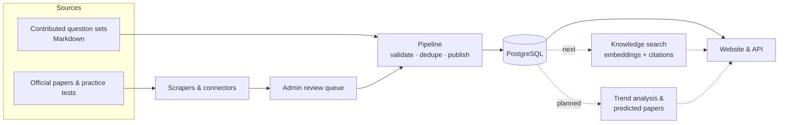

<div align="center">

# Prepora

**Every past exam question in one place — searchable, explained, and used to predict what comes next.**

An open-source exam-preparation platform for students everywhere: certification, government,
competitive and university exams.

[**Website**](https://prepora.xpar.in) · [**Vision & roadmap**](docs/vision.md) ·
[**Contribute**](CONTRIBUTING.md) · [**Discussions**](https://github.com/aswinakofficial/prepora/discussions)

[](https://github.com/aswinakofficial/prepora/actions/workflows/ci.yml)
[](LICENSE)
[](CONTRIBUTING.md)


</div>

---

## Why Prepora

Previous-year questions are the single best way to prepare for an exam — and the hardest thing to
find. They are scattered across PDFs, forums, coaching-centre notes and paywalled sites, rarely with
answers you can trust, and almost never with explanations. Students who can pay for compilations
get ahead; everyone else searches.

Prepora gathers them into one open, well-organised place, keeps them honest (every question is
reviewed and traceable to its source), and then goes further: it lets you **ask** the collection
questions, and it studies years of papers to **predict** what an upcoming exam is likely to ask.

## The three pillars

### 1. Every past question, in one place — *available now, growing*

A pipeline gathers questions from many sources — official papers, practice assessments, contributed
question sets — and a human reviewer approves every batch before it is published. Duplicates are
detected across sources, so re-collecting a source only adds what is new, and each question keeps a
link to where it came from.

### 2. A knowledge system anyone can query — *next*

Ask in plain language — *"How is the bending moment of a simply supported beam calculated?"*,
*"Which topics does GATE CS repeat every year?"* — and get answers grounded in real exam questions
and their explanations, with citations back to the source papers. Built on the same reviewed,
provenance-stamped data as the rest of the site, never on unverified web content.

### 3. Question prediction — *planned*

For an upcoming exam — say NEET next year — Prepora will study every previous paper, learn how
topics, weightage and question styles have shifted over the years, and generate a **predicted
question paper** for students to practise with. Each predicted paper shows which trends it was built
from, and the method is tested against real past papers (predict 2024 from the years before it,
then compare with the actual 2024 paper) with the results published — so students can see how much
to trust it.

Read the full [vision and roadmap](docs/vision.md).

## What you can do today

- **Browse exams by category** — certification, government, competitive and university exams, each
  with its question sets.
- **Practise in two modes** — *Learn* (check each answer as you go, with explanations and further
  reading) and *Simulation* (a timed, exam-like run with a results summary).
- **Multi-answer and image questions** — "choose two"-style questions and questions with diagrams
  work in both modes.
- **Search** across exams and questions.

<div align="center">

</div>

## How it works



| Part | What it is |
|---|---|
| `apps/web` | The website — TanStack Start (React 19, Vite), Tailwind CSS |
| `packages/api` | Type-safe API (oRPC) and business logic |
| `packages/db` | PostgreSQL schema and client (Drizzle ORM) |
| `packages/auth` | Sign-in (Better Auth) |
| `apps/pipeline` | Python pipeline: validation, deduplication, publishing, exam-source connectors |
| `apps/scraper` | Python scraping service (FastAPI + Playwright); runs locally, not on the deployed site |

## Get involved

Prepora is built in the open, and there is room for every kind of help:

- **Developers** — web, API, pipeline and scraping work. Start with a
  [`good first issue`](https://github.com/aswinakofficial/prepora/labels/good%20first%20issue) and
  comment `/claim` to take it ([how it works](CONTRIBUTING.md#finding-something-to-work-on)).
- **Exam-source connectors** — teach Prepora to read a new source of past papers
  ([connector guide](docs/connectors/README.md)).
- **Question contributors** — add past papers in a simple Markdown format; no coding needed
  ([format](agents/content/schema.md)).
- **Data science and ML** — help build the knowledge search and the prediction models.
- **Design, writing and translation** — make it clearer and available in more languages.
- **Research, no code needed** — find and document new sources of past papers
  ([`skill: no-code`](https://github.com/aswinakofficial/prepora/labels/skill%3A%20no-code)).

### Run it locally

You need **Node.js 22**, **pnpm 9**, **Python 3.12** and **PostgreSQL 14+**. Then:

```bash
git clone https://github.com/aswinakofficial/prepora.git
cd prepora
pnpm bootstrap      # installs everything, creates a local database with demo data, writes .env
pnpm dev            # http://localhost:3000
```

`pnpm bootstrap` also creates a local admin account (credentials in your `.env`). No admin rights
for PostgreSQL? Use `pnpm bootstrap --project-db`. Everything else — per-OS setup, checks, how to
open a pull request — is in **[CONTRIBUTING.md](CONTRIBUTING.md)**.

## Content policy

This repository contains **code only**. Questions collected by the scrapers live in the database of
whoever runs them, never in git; test fixtures and demo data use invented questions. See
[Content and scraping policy](CONTRIBUTING.md#content-and-scraping-policy).

## License

[MIT](LICENSE) © Aswin A K and contributors.
