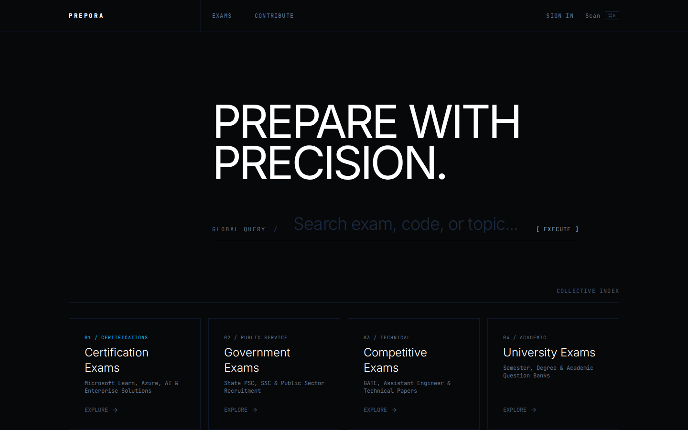
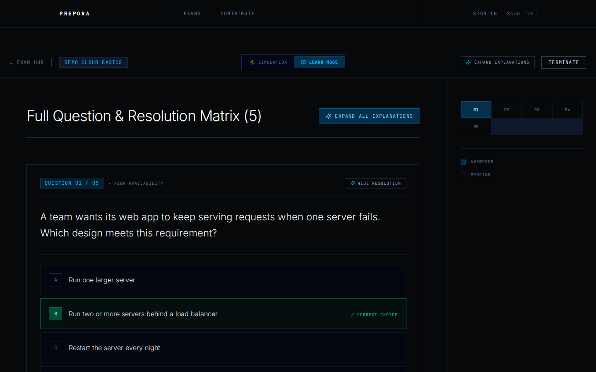
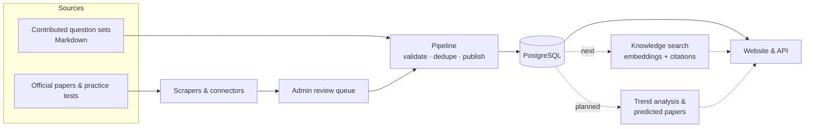

<div align="center">

# Prepora

**Every exam question in the world, in one place: sourced, verified, searchable, and used to help learners prepare for what comes next.**

An open-source exam-preparation platform for students everywhere: certification, government,
competitive and university exams.

[**Website**](https://prepora.xpar.in) · [**Vision & goals**](docs/vision.md) ·
[**Contribute**](CONTRIBUTING.md) · [**Discussions**](https://github.com/aswinakofficial/prepora/discussions)

[](https://github.com/aswinakofficial/prepora/actions/workflows/ci.yml)
[](LICENSE)
[](CONTRIBUTING.md)



</div>

---

## Why Prepora

Previous-year questions are the single best way to prepare for an exam — and the hardest thing to
find. They are scattered across PDFs, forums, coaching-centre notes and paywalled sites, rarely with
answers you can trust, and almost never with explanations. Students who can pay for compilations
get ahead; everyone else searches.

Prepora's goal is to become the world's largest open, trustworthy index of exam questions, across
countries, languages, exam bodies and levels, and to make it useful to every learner for free. Every
question traces back to its source, every answer says where it came from, and nothing is published
without a person's review.

## Goals

1. **Every past question, in one place** — *now.* Every exam type, several sources per exam merged
   without duplicates, browsable by each exam's own hierarchy and searchable across all of them,
   with real papers represented faithfully (sections, marks, numeric ranges, revised keys).
2. **Global scale** — *growing.* Language and region as first-class fields, linked translations,
   and infrastructure that grows in measured stages toward tens of millions of questions.
3. **A knowledge system anyone can query** — *next.* Ask in plain language and get answers grounded
   in real exam questions, with citations; "questions like this one" across exams and languages.
4. **Question prediction** — *planned.* Predicted practice papers built from multi-year topic
   trends, backtested against real papers, and always labelled as practice, never a leak.
5. **Trust and community** — *ongoing.* Provenance on every answer, human review of disagreements,
   community contributions and error reports, AI help that's optional and confirmed by a person.

Read the full [vision and goals](docs/vision.md).

## What you can do today

- **Browse exams by category** — certification, government, competitive and university exams, each
  with its question sets.
- **Practise in two modes** — *Learn* (check each answer as you go, with explanations and further
  reading) and *Simulation* (a timed, exam-like run with a results summary).
- **Multi-answer and image questions** — "choose two"-style questions and questions with diagrams
  work in both modes.
- **Search** across exams and questions.

<div align="center">

</div>

## How it works



| Part | What it is |
|---|---|
| `apps/web` | The website — TanStack Start (React 19, Vite), Tailwind CSS |
| `packages/api` | Type-safe API (oRPC) and business logic |
| `packages/db` | PostgreSQL schema and client (Drizzle ORM) |
| `packages/auth` | Sign-in (Better Auth) |
| `apps/pipeline` | Python pipeline: validation, deduplication, publishing, exam-source connectors |
| `apps/scraper` | Python scraping service (FastAPI + Playwright); runs locally, not on the deployed site |

## Get involved

Prepora is built in the open, and there is room for every kind of help:

- **Developers** — web, API, pipeline and scraping work. Start with a
  [`good first issue`](https://github.com/aswinakofficial/prepora/labels/good%20first%20issue) and
  comment `/claim` to take it ([how it works](CONTRIBUTING.md#finding-something-to-work-on)).
- **Exam-source connectors** — teach Prepora to read a new source of past papers
  ([connector guide](docs/connectors/README.md)).
- **Question contributors** — add past papers in a simple Markdown format; no coding needed
  ([format](agents/content/schema.md)).
- **Data science and ML** — help build the knowledge search and the prediction models.
- **Design, writing and translation** — make it clearer and available in more languages.
- **Research, no code needed** — find and document new sources of past papers
  ([`skill: no-code`](https://github.com/aswinakofficial/prepora/labels/skill%3A%20no-code)).

### Run it locally

You need **Node.js 22**, **pnpm 9**, **Python 3.12** and **PostgreSQL 14+**. Then:

```bash
git clone https://github.com/aswinakofficial/prepora.git
cd prepora
pnpm bootstrap      # installs everything, creates a local database with demo data, writes .env
pnpm dev            # http://localhost:3000
```

`pnpm bootstrap` also creates a local admin account (credentials in your `.env`). No admin rights
for PostgreSQL? Use `pnpm bootstrap --project-db`. Everything else — per-OS setup, checks, how to
open a pull request — is in **[CONTRIBUTING.md](CONTRIBUTING.md)**.

## Content policy

This repository contains **code only**. Questions collected by the scrapers live in the database of
whoever runs them, never in git; test fixtures and demo data use invented questions. See
[Content and scraping policy](CONTRIBUTING.md#content-and-scraping-policy).

## License

[MIT](LICENSE) © Aswin A K and contributors.
