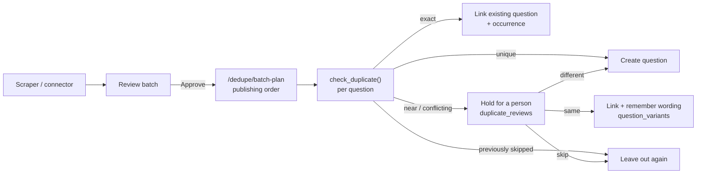

# Duplicate detection

Prepora collects the same questions again and again: MS Learn practice assessments serve questions
at random from a pool, so every re-scrape overlaps the last. Past papers repeat questions year to
year, and the same question can turn up in two exams. The rule is that **every question is
published once**. When it appears in several places, it's one question with an occurrence in each
question set. And **nothing is ever merged silently**: when it isn't certain two questions are the
same, a person decides.

This document describes the shared duplicate-detection layer that enforces that for every source,
and how a source plugs its own specifics into it.

## Where it runs

Scraping never deduplicates. A scrape only stores a review batch (`scraped_questions`), and nothing
reaches the site until the batch is approved. Deduplication happens at **publishing**, question by
question, in the pipeline:



## The shared layer — `apps/pipeline/prepora_pipeline/dedupe/`

Nothing in this package knows about any particular source.

| Module | What it does |
|---|---|
| `normalize.py` | What "the same text" means. The text is NFC-normalized and lowercased, whitespace is collapsed, and everything except letters, combining marks, digits and spaces is dropped. It also computes `content_hash()`, a 32-bit index into that comparison. The logic is versioned by `NORMALIZATION_VERSION`. |
| `fingerprint.py` | A question's **answer shape**: its options and correct answer, normalized, with option order ignored. Identical wording is only the same question when the shapes match too. |
| `similarity.py` | Levenshtein similarity over normalized text. Every near-duplicate decision is scored with it. |
| `candidates.py` | Finds what to compare against, across the **whole corpus** (every exam and subject). Exact matches come from the `content_hash` index plus confirmed variant wordings. Similar ones come from a `pg_trgm` GIN index, which narrows 50,000 questions to the few dozen worth scoring. |
| `check.py` | The decision for one question (`check_duplicate`) and the publishing order for a batch (`plan_batch`). |
| `profile.py` | `DedupeProfile`: the one extension point per source (see below). |
| `audit.py` | The corpus-wide scan behind `pnpm check:duplicates`. |

### Outcomes

| Outcome | Meaning | What publishing does |
|---|---|---|
| `exact_duplicate_in_set` | Same wording, options and answer, already in this question set | Nothing (no-op) |
| `exact_duplicate_cross_set` | The same question, published under another set (exam, year, paper) | Reuses it and adds an occurrence |
| `conflicting_duplicate` | **Identical wording**, but different options or correct answer | Holds it for a person |
| `near_duplicate` | Wording ≥ the profile's threshold (0.9 by default) similar to a published question, anywhere | Holds it for a person |
| `previously_skipped` | A person already chose not to publish exactly this question | Leaves it out again |
| `unique` | Nothing like it is published | Creates it |

`conflicting_duplicate` exists because matching on wording alone used to fold a second question into
the first. MS Learn scenarios often end in the same "Which portal should you use?", with different
options, or a corrected answer key. The review suggests "same" when only the options changed and the
answer didn't, and "different" otherwise. Either way a person confirms.

### Decisions are made once

Whatever a person decides is remembered, so the same question is never asked about twice:

- **Same, keep the published version.** The new wording is saved in `question_variants` and matches
  exactly from then on. For identical wording with different options, the decision in
  `duplicate_reviews` is what's remembered.
- **Same, keep the new version.** The published question takes the new wording, options and answer
  in place. Its id, URL, occurrences and option ids stay the same. The old wording becomes the
  variant.
- **Different.** The question is published as a new one. With identical wording, it gets a distinct
  stable id (`stable_id.py`, `distinct=True`) so both can exist. From then on each version is simply
  an exact match.
- **Skip.** Recorded in `duplicate_reviews`. When exactly that question (wording, options and answer)
  is held against the same published question again, it comes back `previously_skipped`.

### Concurrency

A batch publishes several questions at once, and batches can be approved in parallel. Two guards
cover this:

- **Within a batch:** `plan_batch()`, reached over HTTP as `/dedupe/batch-plan`, orders the batch into
  waves. A question that repeats or nearly repeats an earlier one in the same batch is published in a
  later wave, so it's checked against the earlier one once that is published. If they were published
  at the same moment, neither would see the other.
- **Across everything:** publishing takes a transaction-scoped advisory lock on the wording's hash and
  repeats the exact check under it. Two copies of the same new question can't both create one; the
  second waits for the first to commit and then finds it.

Position identity (exam papers) has one more rule. If "question 7 of the 2025 paper" is already
published with different content, publishing another question 7 **fails with a reason**. It isn't
silently reused. (It used to be reused, which dropped the new question.)

## What a source provides — `DedupeProfile`

A source declares its specifics in its connector directory. The shared layer finds the profile from a
question's `source_url`, by matching it to the source whose `base_url` host it's on.

```yaml
# connectors/<source>/source.yaml
dedupe:
  identity: content               # position (default) | content
  near_duplicate_threshold: 0.9   # 0.5–1
```

```python
# connectors/<source>/dedupe.py (optional)
COMPARISON_CLEANERS = (strip_question_counter,)  # str -> str, applied before scoring
```

- **identity** says how a question is identified across scrapes:
  - `position` suits exam papers, where question N of a paper is a fixed thing.
  - `content` suits pools that serve questions in random order, like MS Learn.

  A producer can still set `identity` on a question explicitly; otherwise the source's applies.
- **near_duplicate_threshold** is how similar two questions' wording must be to be held for review.
- **comparison cleaners** strip text a source wraps around its questions, such as counters and fixed
  answering instructions, so it doesn't skew similarity. They affect **scoring only**. Stored text and
  content hashes always use plain normalization, so changing a profile can't orphan existing
  questions.

Microsoft Learn's profile (`connectors/ms-learn/`) is the worked example:
- **identity:** `content`.
- **cleaners:** strip "Question 12 of 50:" and the "Each correct answer presents a complete solution"
  / "NOTE: Each correct selection is worth one point" instructions.

The review queue's **quality checks** follow the same split. The generic check (an answer that
matches none of the options) lives in `packages/api/src/lib/review-quality.ts`. Checks for failures
only one source's scraper has had live with that source, in `packages/api/src/lib/sources/<source>.ts`,
and run only on batches from it. Microsoft Learn's are the placeholder explanations, "| Microsoft
Learn" page titles, and site-menu links. They're in `packages/api` rather than the connector
directory because the review queue is rendered by the deployed site, which can't reach the pipeline.

## One definition of "the same text"

Normalization exists in Python (`dedupe/normalize.py`) and in one TypeScript port
(`packages/content/src/normalize.ts`, exported as `@prepora/content/normalize`). The port is used by:
- the review queue's "N new · M already in exam" preview (`packages/api/src/lib/review-dedupe.ts`);
- the Markdown contribution checker (`packages/content/src/duplicates.ts`).

Both are pinned to the same cases by `dedupe/fixtures/normalization.json`. The Python tests and
`packages/content/src/normalize.test.ts` both run against it, so they can't drift apart.

To change normalization:
1. Change both implementations.
2. Bump `NORMALIZATION_VERSION` in both.
3. Regenerate the fixtures from Python.
4. Check the database, because every stored `content_hash` depends on it.

Version 2, the current one, started keeping combining marks. Version 1 dropped Malayalam and
Devanagari vowel signs, so "കേരളം" and "കരളം" normalized alike. No published question contained any,
so no stored hash changed.

## Checking the whole corpus

```bash
pnpm check:duplicates                        # or: … dedupe-audit --min-similarity 0.8
```

Every published question is compared with every other, using the trigram index for candidates and
the same scoring as publishing. The scan reports three things:

- **Exact duplicates** (same wording, options and answer): these should never exist, and the command
  exits 1 if any do.
- **Same wording, different options or answer:** expected where a person chose "different"; listed for
  a look.
- **Similar wording** (≥ 85% by default): mostly the template variants certification exams are full of
  ("Java" → Maven, ".NET" → NuGet). Each pair is listed with whether its options and answer match, so
  real repeats stand out.

## Known limits

- **Meaning, not wording.** The same question in completely different words, or in another language
  (Malayalam and English versions of a PSC question), isn't detected. Semantic matching with
  embeddings is the planned next phase. It shares its embeddings with knowledge search.
- **Across two batches approved at the same moment,** two *near* duplicates (not exact ones, which the
  lock covers) could both be published. Approving batches one at a time avoids it, and the audit
  would list the pair.
- **Hashing outside the Basic Multilingual Plane** (emoji, some rare scripts) differs between Python,
  which iterates code points, and JavaScript, which iterates UTF-16 units. It affects only the
  TypeScript preview's counts, never publishing.
