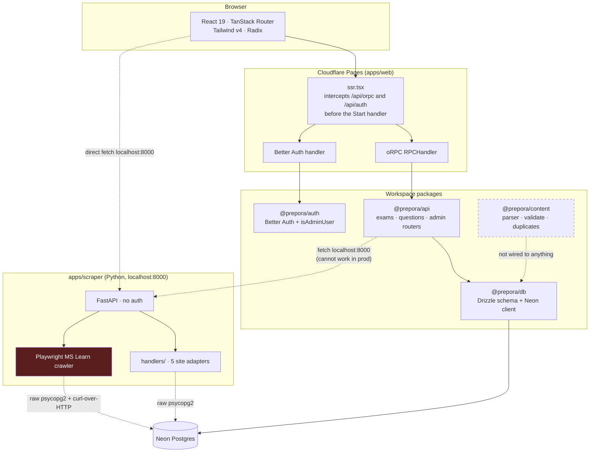
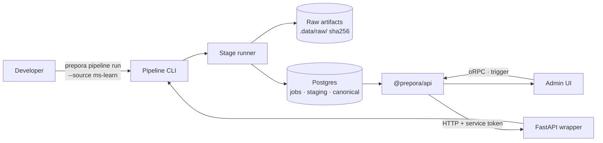
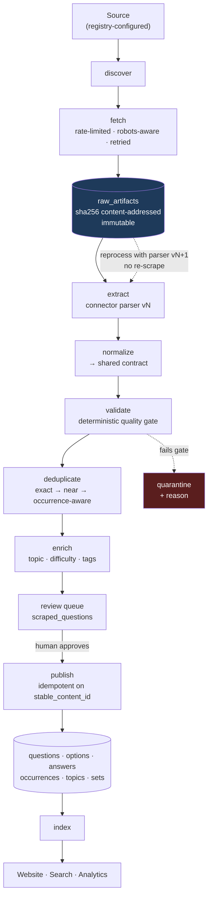
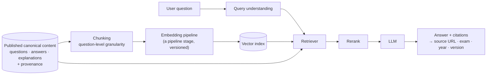

# Prepora — Architecture Assessment & Next-Level Plan

> **Status:** Draft for review · **Date:** 2026-09-19 · **Scope:** Evidence-based audit of the
> repository as it stands, plus a recommended target architecture and migration path.
>
> Every claim in this document was verified against source and is cited as `path:line`. Where the
> repository does *not* do something, that is stated as an absence with the search that established
> it — this document does not credit Prepora with capabilities it does not have.

---

## Table of contents

1. [Current architecture](#1-current-architecture)
2. [Repository inventory](#2-repository-inventory)
3. [Current strengths](#3-current-strengths)
4. [Current weaknesses](#4-current-weaknesses)
5. [Technical debt register](#5-technical-debt-register)
6. [Data pipeline assessment](#6-data-pipeline-assessment)
7. [Scraper architecture assessment](#7-scraper-architecture-assessment)
8. [FastAPI service assessment](#8-fastapi-service-assessment)
9. [Admin assessment](#9-admin-assessment)
10. [Database assessment](#10-database-assessment)
11. [Search assessment](#11-search-assessment)
12. [Analytics assessment](#12-analytics-assessment)
13. [Security assessment](#13-security-assessment)
14. [Open-source readiness](#14-open-source-readiness)
15. [Local execution architecture](#15-local-execution-architecture)
16. [Cloud execution alternatives](#16-cloud-execution-alternatives)
17. [Recommended target architecture](#17-recommended-target-architecture)
18. [Migration plan](#18-migration-plan)
19. [P0–P3 backlog summary](#19-p0p3-backlog-summary)
20. [Architectural risks](#20-architectural-risks)
21. [ADR recommendations](#21-adr-recommendations)
22. [Future RAG architecture](#22-future-rag-architecture)

---

## Executive summary

Prepora is a well-designed **content model** wrapped in a **polished frontend**, connected by a
**pipeline that does not yet exist as a system**. The gap between what the repository appears to do
and what it actually does is the central finding of this audit.

Three findings reframe all downstream work:

**1. The system fabricates content.** When the Python scraper is unreachable, the Node fallback
invents question options and answer keys for every extracted item
(`packages/api/src/routers/admin.router.ts:307-308`), and when that yields nothing, it inserts a
wholly fabricated question into the human review queue (`admin.router.ts:319-325`). Separately, the
public exams API substitutes a hardcoded sample question set into live responses whenever real data
is empty (`packages/api/src/routers/exams.router.ts:244-286`). For a platform whose stated core
asset is trustworthy structured exam content, content that is invented by a failure path and is
indistinguishable from scraped content is the highest-severity defect in the repository.

**2. Reprocessing is impossible.** Raw HTML is truncated to 2000 characters before storage
(`apps/scraper/main.py:183`), and the Playwright path stores a human-readable description string
instead of markup (`apps/scraper/ms_learn_catalog_crawler.py:695`). A parser bug therefore cannot be
fixed by re-running the parser — it requires re-scraping the live source, which for the
authenticated Microsoft Learn flow means re-driving a browser session. Reprocessing stored raw data
through an improved parser is the single most valuable data-engineering capability a pipeline of
this shape can have, and the current design forecloses it.

**3. Most of the "platform" is schema and mock UI, not behaviour.** Search is hardcoded demo data
(`apps/web/app/routes/search.tsx:23-31`). Seven tables — `analyticsEvents`, `searchQueries`,
`auditLogs`, `contentVersions`, `redirects`, `attempts`, `practiceSessions` — are fully migrated into
Postgres and never written to by any code path. The canonical/occurrence content model, which is the
best architectural decision in the repository, is never populated by the publish path.

The good news is that the foundations that are hardest to get right are already right. The content
model correctly separates a canonical question from its per-exam-per-year occurrences. A raw staging
table exists. oRPC produces a genuine OpenAPI specification from the same definitions that serve the
frontend. The validation and deduplication logic in `packages/content` is careful, deterministic
work. **The task is not to rebuild Prepora. It is to build the pipeline the existing model already
anticipates, and to delete the scaffolding that currently stands in for it.**

---

## 1. Current architecture



**Request path.** `apps/web/app/ssr.tsx` is the true entry point. It intercepts any URL containing
`/api/orpc` (`ssr.tsx:40`) or `/api/auth` (`ssr.tsx:58`) *before* delegating to the TanStack Start
handler, and synchronises Cloudflare environment bindings into `process.env` on every request via
`setAuth()` (`ssr.tsx:26-38`). Dedicated API routes for both paths also exist
(`apps/web/app/routes/api/orpc.$.ts`, `apps/web/app/routes/api/auth.$.ts`) and are therefore
unreachable in normal operation — see §5.

**Read path.** Public pages call oRPC procedures through TanStack Query utils
(`apps/web/lib/orpc.ts`). Admin pages do the same, plus a `createServerFn` guard on the `/admin`
layout (`apps/web/app/routes/admin.tsx:10-29`).

**Write path.** There are two, and they do not share code. The Python service writes scraped rows
directly to Postgres via raw `psycopg2`. The Node admin router promotes those rows into canonical
tables on approval (`admin.router.ts:157-224`). The TypeScript content pipeline in
`packages/content` — parser, validator, deduplicator — is connected to neither; its import script is
a stub (§6).

**Deployment.** Cloudflare Pages, preset `cloudflare-pages` (`apps/web/app.config.ts:6-8`), backed by
Neon serverless Postgres over HTTP (`packages/db/src/client.ts:2`). The Python service has no
deployment target at all and is addressed as `http://localhost:8000` from code that runs on
Cloudflare (§7).

---

## 2. Repository inventory

| Path | Language | Tracked in git | Role |
|---|---|---|---|
| `apps/web/` | TypeScript | partially | TanStack Start app: 28 routes, SSR entry, oRPC + auth interception |
| `apps/scraper/` | Python | **no** | FastAPI service, 5 site handlers, 2 Playwright crawlers |
| `packages/db/` | TypeScript | partially | Drizzle schema (6 modules), Neon client, 4 ad-hoc DDL scripts |
| `packages/api/` | TypeScript | **no** | oRPC routers: `exams`, `questions`, `admin` |
| `packages/auth/` | TypeScript | **no** | Better Auth instance, `isAdminUser`, `requireAdmin` |
| `packages/content/` | TypeScript | yes | Markdown parser, Zod schemas, validator, deduplicator |
| `packages/config/` | — | yes | Shared `tsconfig.base.json` |
| `scripts/` | TypeScript | yes | 6 content CLI tools + 1 design-snapshot script |
| `agents/content/` | Markdown | yes | Content Agent brief, Markdown format spec, content rules, 2 examples |
| `drizzle/` | SQL | partially | 2 generated migrations + journal |
| `content/` | — | yes | `README.md` only — **no content files exist** |
| `.stitch/` | HTML | yes | 5 static page snapshots + a design-system spec, for a visual design loop |
| `reactive-resume-repo/` | — | **no, and not ignored** | 81 MB third-party clone used as a reference for `analysis_report.md` |

**Git state.** 24 commits, all between 2026-09-01 and 2026-09-05; 19 of them are authentication and
environment-variable firefighting. The working tree has 59 changed or untracked paths totalling
4,200+ insertions. `apps/scraper/`, `packages/api/` and `packages/auth/` have **never been
committed** — roughly two weeks of work exists only on one machine, with no history and no review
trail. `reactive-resume-repo/` is untracked *and* absent from `.gitignore`, so a `git add .` commits
81 MB of third-party source.

**Scale.** 92 tracked files. Largest routes: `admin/scraping.tsx` (1,034 lines), `practice.tsx`
(948), `topics/$topicSlug.tsx` (525), `admin/review.tsx` (468).

---

## 3. Current strengths

These are real and should be built on rather than replaced.

**The content model is correct.** `questions` holds canonical question records keyed by
`stableContentId` (`packages/db/src/schema/questions.ts:28`), and `questionOccurrences`
(`questions.ts:88-108`) records each appearance of a question in a specific question set, with the
original question number, page number and source reference. This is precisely the model needed to
express "this question genuinely appeared in both the 2023 and 2024 papers" without duplicating the
question — the distinction the brief calls out as extremely important. It exists today. It is simply
never populated (§9).

**A raw staging boundary already exists.** `scraped_questions` (`packages/db/src/schema/scraping.ts:12-27`)
separates ingested material from canonical content and carries a review status. The concept is
right; the implementation loses the raw payload (§6).

**oRPC earns its place.** One procedure definition serves the typed frontend client
(`apps/web/lib/orpc.ts`), the HTTP handler, and a genuine OpenAPI 3 document generated from the live
router (`apps/web/app/routes/api/openapi/spec.json.ts:11-17`). This is a real instance of
write-once-use-three-ways, and it is the natural place to later attach an MCP surface.

**`packages/content` is careful work.** `validate.ts` implements seven deterministic business rules
with error/warning severities and no I/O. `duplicates.ts` combines a normalised exact-match hash
with Levenshtein near-duplicate detection at a 0.9 threshold (`duplicates.ts:65-101`), and
deliberately never auto-merges — it reports for human review, matching the stated content rules.
This logic is worth porting rather than rewriting.

**Type checking is clean.** `tsc --noEmit` passes with zero errors across `@prepora/web` and
`@prepora/db`. TypeScript is configured `strict` (`packages/config/tsconfig.base.json:3`).

**The frontend is genuinely good.** The editorial dark aesthetic is consistent, routes carry
per-page `head` metadata, and the admin surface is thoughtfully laid out. The product half of the
"student-facing / engineering-facing" split is the more complete half.

---

## 4. Current weaknesses

Twenty-seven verified defects, ordered by severity. Referenced throughout the rest of this document
by number.

### Content integrity

| # | Finding | Evidence |
|---|---|---|
| 1 | A failed scrape inserts a **hardcoded fabricated question** — complete with plausible options and a correct answer — into the review queue | `admin.router.ts:319-325` |
| 2 | The regex fallback scraper invents `["Option A","Option B","Option C","Option D"]` **and an answer key** for every item it extracts | `admin.router.ts:307-308` |
| 3 | The public exams API substitutes `sampleAb100Questions` into live responses when real data is empty, indistinguishable from real content downstream | `exams.router.ts:244-286` |
| 12 | `FLAG FOR HUMAN REVIEW` — the safety mechanism mandated by the content rules — is not recognised by the parser. It parses as an ordinary text answer and **passes validation** | `parser.ts:43` vs `agents/content/rules.md:27-38` |
| 13 | Deduplication compares only within a single file and receives no exam/year context, so it structurally cannot distinguish a legitimate repeat from a duplicate record | `duplicates.ts:65`, `scripts/check-duplicates.ts:33` |
| 11 | Answer-key mapping on approval is exact string equality between option text and answer text; any whitespace or formatting difference silently produces a question with no correct answer | `admin.router.ts:211` |

### Data engineering

| # | Finding | Evidence |
|---|---|---|
| 7 | Raw HTML truncated to 2000 chars; the Playwright path stores a description string, not markup. **Reprocessing without re-scraping is impossible** | `main.py:183`, `ms_learn_catalog_crawler.py:695` |
| 8 | Job state is a module-level in-memory `set()` plus a `/tmp` logfile tail. No job table, no run history, no durable status | `main.py:114`, `ms_learn_catalog_crawler.py:20` |
| 9 | `discover_next_links` is implemented on all six handlers and **never called anywhere** — there is no pagination or multi-page crawl | `handlers/base.py:21`, zero call sites |
| 10 | Approval generates a random 4-character slug suffix and never populates `questionOccurrences`, `topicId`, or any link to `questionSets` — published questions float disconnected from the catalog | `admin.router.ts:194-216` |
| 14 | `import-content.ts` never writes to the database; the canonical Markdown import path is a commented-out stub | `scripts/import-content.ts:56-60` |
| — | No content hashing, ETag, `last_modified` or `last_seen` anywhere — every crawl is a cold full re-fetch | no `hashlib` usage in `apps/scraper` |
| — | No retries, no backoff, no rate limiting, no concurrency control, no `robots.txt` handling | no such code in `apps/scraper` |

### Security

| # | Finding | Evidence |
|---|---|---|
| 4 | `POST /scrape` takes an arbitrary caller-supplied URL and fetches it server-side with no scheme allowlist, no host allowlist, no private-IP or cloud-metadata denylist, and redirects followed by default — a general-purpose SSRF primitive | `main.py:27,164` |
| 5 | **No authentication on any FastAPI endpoint**, and CORS is `allow_origins=["*"]` with `allow_credentials=True` | `main.py:18-24` |
| 6 | `DATABASE_URL` is passed as an HTTP header to a **hardcoded Neon hostname** via `subprocess` shelling out to `curl` | `ms_learn_catalog_crawler.py:690-716` |
| 17 | `wipeDatabase` TRUNCATEs eight tables CASCADE with no confirmation token, no rate limit and no audit record | `admin.router.ts:66-77` |
| 19 | Secret-presence and secret-*length* diagnostics are exposed on any URL containing "health" or "debug", duplicated across four files | `health.ts`, `debugauth.ts`, `auth.$.ts`, `ssr.tsx:62-80` |
| — | The Node→Python call accepts a caller-supplied `backendUrl`, letting an admin point the server at an arbitrary backend whose response is trusted into the review queue | `admin.router.ts:250,261` |

### Architecture and correctness

| # | Finding | Evidence |
|---|---|---|
| 15 | Search is entirely hardcoded demo data and never calls any API; `searchQueries` is never written | `search.tsx:23-31` |
| 16 | `analyticsEvents`, `searchQueries`, `auditLogs`, `contentVersions`, `redirects`, `attempts`, `practiceSessions` are **dead schema** — migrated, indexed, never written | `schema/analytics.ts`, `schema/users.ts:89-130` |
| 18 | oRPC and auth are each handled twice; `ssr.tsx` intercepts first, making the dedicated route files unreachable | `ssr.tsx:40,58` vs `routes/api/{orpc,auth}.$.ts` |
| 20 | `isAdminUser` is reimplemented from scratch in `useRBAC.ts` rather than reused, creating a second copy of the authorisation rule that can drift | `useRBAC.ts:20-30` |
| 21 | `/api/llms-txt` advertises an `/mcp` endpoint that does not exist and lists exam domains absent from the database | `llms-txt.ts:17,21,26` |
| 22 | `db` silently becomes `{} as any` when `DATABASE_URL` is missing, turning a configuration error into cryptic property access failures | `client.ts:32` |
| 23 | `sitemap.xml` references `sitemap-question-sets.xml` and `sitemap-questions.xml`, which the generator never creates; three production domains appear across the repo | `public/sitemap.xml`, `robots.txt:4`, `packages/auth/src/index.ts:11-12` |
| 24 | Four ad-hoc DDL scripts bypass the Drizzle migration journal, including a `TRUNCATE TABLE users CASCADE` utility | `packages/db/{clean.mjs,migrate.js,migrate-accounts.mjs}`, `src/create_scraped_table.ts` |
| 25 | Zero tests. No `vitest.config.*` or `playwright.config.*` despite both being scripted and installed. `pnpm lint` is a no-op — no package defines a `lint` script and no ESLint or Biome config exists | verified absent |
| 26 | No CI, no Dockerfile, no committed deployment configuration | no `.github/` directory |
| 27 | Seven independent hardcoded mock datasets, with the same Strength-of-Materials questions recurring near-verbatim across at least three files | `practice.tsx:192`, `topics/$topicSlug.tsx:35`, `search.tsx:23`, others |

---

## 5. Technical debt register

Debt is grouped by what it costs, not by where it lives.

**Debt that blocks correctness.** Findings 1–3 and 11–14. Until the fabrication paths are removed
and the publish path populates the catalog relationships, no statement about content quality is
defensible, and no metric computed over the content means anything.

**Debt that blocks iteration.** Finding 7 is the keystone: because raw artifacts are not retained,
every parser improvement costs a full re-scrape. This turns a cheap, safe, offline operation into an
expensive, rate-limited, potentially authenticated one, and it is the reason connector development
currently has no fast feedback loop. Findings 25 and 26 compound it — with no tests and no CI,
there is no signal that a parser change was safe.

**Debt that blocks deployment.** The scraper is addressed as `http://localhost:8000` from three
places that run on Cloudflare (`admin.router.ts:234,261`, `admin/scraping.tsx:146,172,245`). The
admin scraping UI additionally calls the Python service *directly from the browser*, so the feature
cannot function against any deployed instance. This is not a bug to fix in place; it is a boundary
that needs designing (§15, §16).

**Debt from the authentication incident.** Nineteen of twenty-four commits, four duplicated
`envAudit` blocks, a `/api/debugauth` route, a proxy-wrapped Better Auth instance, nine environment
sources probed in sequence (`auth.$.ts:8-24`), and a duplicated handler pair (finding 18) are all
sediment from one production incident about Cloudflare environment bindings. The incident is
resolved; the scaffolding remains and should be removed deliberately rather than left to rot.

**Debt from parallel implementations.** Two write paths that do not share code (Python direct-insert
vs. Node approval), two deduplication implementations (`duplicates.ts` and the `ilike` collision
check at `admin.router.ts:143`), two question-text cleanup implementations (`practice.tsx:63-159`
duplicated in `admin/review.tsx:43-154`), four admin-authorisation code paths, and seven mock
datasets. Each pair is a place where a fix can be applied to one copy and not the other.

**Debt in the schema-migration story.** Finding 24. Schema state is currently the union of what
Drizzle's journal knows and what four hand-written scripts did. These can silently diverge per
environment, and nothing detects the divergence.

---

## 6. Data pipeline assessment

The brief asks for an explicit pipeline with every stage named. Here is what exists against that
target.

| Stage | Status | Evidence |
|---|---|---|
| **Discover** | Implemented but **dead** — `discover_next_links` exists on every handler, is called by nothing | `handlers/base.py:21`; zero call sites |
| **Fetch** | Present, no politeness controls | `main.py:164`; Playwright `page.goto` |
| **Extract** | Present, per-site, hand-rolled selectors with no shared field contract | `handlers/*.py` |
| **Normalize** | Ad hoc, inside handlers, inconsistent between them | regex cleanup at `ms_learn_catalog_crawler.py:512-543` |
| **Validate** | **Absent from the scrape path.** A good validator exists in TypeScript, unconnected | `validate.ts` unreferenced by the scraper |
| **Deduplicate** | Within-request only. Exact text equality in one handler; none in three others; a naive `ilike` check at review time | `generic.py:52-58`, `admin.router.ts:143` |
| **Enrich** | Absent — no topic, difficulty, or tag classification anywhere | no such code |
| **Store (raw)** | Lossy. Truncated to 2000 chars or replaced by a description string | `main.py:183`, `ms_learn_catalog_crawler.py:695` |
| **Review** | Present and genuinely useful — the strongest part of the current pipeline | `admin/review.tsx`, `admin.router.ts:157-224` |
| **Publish** | Present but incomplete — writes `questions`/`questionOptions`/`questionAnswers`, never `questionOccurrences`, `topicId` or `questionSets` | `admin.router.ts:190-221` |
| **Index** | Absent — no search index of any kind | §11 |

**The parallel TypeScript pipeline.** `packages/content` implements Markdown parsing, Zod-validated
frontmatter, seven business rules, and two-stage deduplication — and terminates in a stub:

```ts
// TODO: Wire up actual DB import once DATABASE_URL is configured.
// const { db } = await import("@prepora/db");
// await importQuestionSet(db, parseResult.data);
```
— `scripts/import-content.ts:56-59`

The referenced `importQuestionSet` does not exist anywhere in the repository. `content/` contains
only a `README.md`; there are no content files to import. So the Markdown pipeline is a complete,
well-tested-in-principle design that has never processed real data, while the scraper pipeline
processes real data with none of those protections.

**The shape mismatch.** The scraper emits, per question:
`{questionText, options: string[], answer: str, explanation, exam, subject}` (`handlers/generic.py:30-37`).
The content package expects `{key, text}[]` options with single-letter keys, a discriminated-union
answer carrying `correctKey`, slugged exam/subject identifiers, a question number, and set-level
frontmatter. Bridging these is a normalisation stage — which is exactly the stage that does not
exist.

**Assessment.** There is no pipeline. There are two half-pipelines in two languages, joined by a
review queue, with the validation half attached to the side that has no data and the data half
attached to the side that has no validation. Unifying them is the central architectural task.

---

## 7. Scraper architecture assessment

**Dispatch.** `get_handler_for_url` iterates a hardcoded, order-sensitive list
(`handlers/__init__.py:10-16`) and returns the first handler whose regex matches, with
`GenericHandler` as a catch-all that must remain last (`generic.py:9`). Adding a source requires
editing both the import block and the list, minding ordering. There is no configuration-driven or
dynamic registration.

**The abstraction is bypassed for its most important source.** Microsoft Learn is special-cased by
substring match in `main.py:128` before `get_handler_for_url` is ever reached, so `MsLearnHandler`
is effectively dead for real traffic. The substring is `"microsoft.com"`, which also matches
unrelated Microsoft URLs.

**The fallback is dangerous.** If the Playwright branch raises, `main.py:153-154` silently falls
through to a plain `requests.get` of the same URL. For an authenticated practice assessment this
fetches a login redirect and parses it as though it were content.

**The base contract is thin.** `BaseScraperHandler` (`handlers/base.py:5-23`) specifies
`domain_patterns`, `parse_questions`, and the unused `discover_next_links`. It does not specify or
enforce the output shape, so each handler independently constructs its own dictionary and
consistency rests on developer discipline. There is no fixtures directory, no contract test, and no
per-source README.

**Politeness and resilience.** Timeouts exist (12s, 15s, 30s). Retries, backoff, rate limiting,
concurrency caps and `robots.txt` handling do not. The user-agent is a hardcoded Chrome string
duplicated in three places, none of which identifies the crawler — the only self-identifying agent
in the system is `PreporaScraperBot/1.0` in the Node fallback (`admin.router.ts:300`), which is the
code path that should not exist at all.

**Incremental crawling.** Absent. No hashing, no conditional requests, no `last_seen` tracking. Each
scrape of the same URL appends another `scraped_questions` row, because there is no `ON CONFLICT`
clause anywhere and the only idempotency guard is the in-memory `seen_jobs` set — which returns
`db_saved: True` for a suppressed duplicate despite having saved nothing (`main.py:118-122`).

---

## 8. FastAPI service assessment

Five endpoints: `/health`, `/scrape/logs`, `/scrape/ms-learn/catalog`, `/scrape/ms-learn/auth`,
`/scrape`.

**None of them is authenticated.** Anyone who can reach port 8000 can trigger arbitrary scrapes,
read logs, or launch an interactive Microsoft OAuth browser window on the host
(`main.py:101-112`). CORS is wide open with credentials enabled (`main.py:18-24`) — a combination
browsers reject, which indicates the configuration was never exercised as designed rather than
deliberately chosen.

**The service does too much and knows too little.** `crawl_ms_learn_assessment` is a single
~550-line function (`ms_learn_catalog_crawler.py:196-750`) that discovers, fetches, extracts,
normalises via regex, and inserts into Postgres. There is no seam at which to test, resume, or
observe it.

**Database access is hand-rolled and duplicated.** Three separate copies of the same
`INSERT INTO scraped_questions` statement exist (`main.py:176-195`,
`ms_learn_catalog_crawler.py:722-744`, `ms_learn_assessment_crawler.py:250-269`). A new connection
is opened per request with no pooling (`main.py:35-43`).

**The curl path must go.** Before falling back to `psycopg2`, the crawler shells out to `curl` to
POST SQL at a hardcoded Neon endpoint, passing the full connection string as an HTTP header
(`ms_learn_catalog_crawler.py:690-716`). This hardcodes one project's infrastructure, puts a
credential in a header sent to a fixed external host, and introduces a subprocess dependency for
something `psycopg2` already does on the next lines.

**Session handling.** The MS Learn authenticated flow launches a headful Chromium with a persistent
profile at `~/.cache/ms_learn_scraper_profile` (`ms_learn_catalog_crawler.py:19`) — outside the repo,
so not a git exposure risk — using a hardcoded MSAL authorize URL with a captured `client_id`,
`code_challenge`, `nonce` and `state` (`ms_learn_catalog_crawler.py:138-149`). This is a replayed
request from Microsoft's own web application rather than an OAuth client Prepora owns, which is
fragile and should be reviewed against Microsoft's terms before this source is enabled in any shared
environment.

---

## 9. Admin assessment

**Authorisation is correct at the oRPC layer.** `adminProcedure` (`admin.router.ts:10-22`) extends
`protectedProcedure` and additionally calls `isAdminUser` (`packages/auth/src/index.ts:129-142`),
which checks `role === "admin"` or membership of the `ADMIN_USERS` environment list. Admin
procedures require admin, not merely a session. This is the right design.

**But it is implemented four times.** `isAdminUser` is the canonical helper; `requireAdmin` wraps
it; `verifyAdminFn` in `admin.tsx:10-29` calls `requireAdmin`; and `useRBAC.ts:20-30`
**reimplements the environment-list parsing from scratch** rather than calling the helper. Four code
paths for one rule, one of which can drift independently.

**`wipeDatabase` needs a stronger gate.** It TRUNCATEs eight tables CASCADE (`admin.router.ts:77`)
behind nothing more than the admin check, with no typed confirmation, no rate limit, and no record
written to the `auditLogs` table that exists for exactly this purpose. The UI describes it as
irreversible (`admin/settings.tsx:129`); the backend treats it as an ordinary mutation.

**The review queue is the best part of the admin surface** — and it promotes content into a broken
shape. `processReviewItem` (`admin.router.ts:157-224`) validates only
`el.questionText && el.options && el.answer` (`:191`), generates a slug with a random suffix
(`:194`), matches the answer by exact string equality against option text (`:211`), and never writes
`questionOccurrences`, `topicId`, or any `questionSets` link. The result is canonical rows that the
exam, subject and topic pages cannot reach.

**The scraping console cannot work in production.** `admin/scraping.tsx` calls
`http://localhost:8000` directly from the browser for MS Learn catalog and auth
(`scraping.tsx:172,245`), and holds a static registry of six target sites in component source
(`scraping.tsx:43-122`) — a registry that belongs in the database (§17).

**Separation of concerns.** The brief asks for Content / Pipeline / Review / Analytics as distinct
admin areas. Today the sidebar lists eleven destinations (`admin.tsx:60-72`) of which six have no
route implemented, and `admin/contributions.tsx` simulates its entire CRUD in local React state
(`contributions.tsx:23-73`) without calling any API.

---

## 10. Database assessment

**Schema quality is high.** Six well-organised modules, consistent use of shared `id()` and
`timestamps` helpers (`schema/shared.ts:15-27`), sensible enums, thorough indexing including
composite indexes where queries warrant them (`catalog.ts:106`), and correct cascade rules.

**The canonical/occurrence model is the standout decision** and is discussed in §3.

**Seven tables are dead.** `analyticsEvents`, `searchQueries`, `auditLogs`, `redirects`,
`contentVersions` (`schema/analytics.ts`), `attempts` and `practiceSessions`
(`schema/users.ts:89-130`) have zero writes and zero reads across the entire repository. They are
not wrong — they are a good sketch of the system that should exist — but they currently function as
documentation rather than infrastructure, and they should be treated as a design to implement, not a
capability to claim.

**Migration governance is split.** Drizzle Kit is configured correctly (`drizzle.config.ts:9-10`
points at the real schema barrel and the repo-root `drizzle/` output) with a clean two-entry
journal. Alongside it sit four hand-written scripts that alter schema outside the journal
(finding 24), including `clean.mjs`, which TRUNCATEs `users` CASCADE with a comment describing it as
cleanup after "previous schema errors". Environments that ran one mechanism and not the other are
silently divergent.

**The client has a dangerous default.** `packages/db/src/client.ts:32` resolves `db` to
`{} as any` when `DATABASE_URL` is absent, so a misconfiguration surfaces as
`TypeError: db.select is not a function` deep in a request rather than as a startup failure.

**Role model mismatch.** The database defines `adminRoleEnum` as `admin | editor | moderator`
(`schema/shared.ts:84-88`); the frontend defines `UserRole` as `admin | user | guest`
(`useRBAC.ts:5`). Editor and moderator have no meaning in the application.

---

## 11. Search assessment

There is no search. `/search` renders a hardcoded `demoResults` object containing two fake
questions, one fake topic and one fake exam (`search.tsx:23-31`). The `q` search parameter is read
only to display it in a heading (`search.tsx:34,91-96`) and is never sent anywhere. The ⌘K command
palette is likewise hardcoded (`SearchCommandModal.tsx:10-26`) and merely navigates to the mock
page.

There is no search router in `packages/api` — `index.ts` registers only `exams`, `questions`,
`admin`, `health` and `me`. The only `ILIKE` in the entire codebase is the duplicate-collision check
in the review queue (`admin.router.ts:143`). There is no `tsvector`, no full-text index, no search
abstraction, and `searchQueries` is never written.

**Assessment.** This is greenfield, which is fortunate: it can be built correctly the first time.
Postgres full-text search is sufficient for the foreseeable corpus and requires no new
infrastructure. The important decision is not the engine but the seam — a `SearchProvider` interface
so that Postgres FTS, and later a dedicated engine or vector index, are implementation choices
rather than rewrites.

---

## 12. Analytics assessment

Product analytics: none. Pipeline analytics: none. The tables to hold both exist and are unused
(§10).

`questions.submitAnswer` (`packages/api/src/routers/questions.router.ts:41-76`) is a real,
authenticated oRPC procedure that scores an answer server-side — and it has zero call sites. Its own
comment records the gap: `// Here you would typically log the attempt into userAnalytics or
progression tables` (`questions.router.ts:68`). Practice mode keeps every piece of state in React
`useState` (`practice.tsx:239-253`) and scores client-side (`practice.tsx:299-309`); results are lost
on refresh.

**Assessment.** The analytics story is currently aspirational. The gap between the schema and the
behaviour is wide enough that the schema should be treated as the specification for P2 work, and no
analytics capability should be described in the README until it writes rows.

---

## 13. Security assessment

Ordered by exploitability.

**SSRF, unauthenticated (findings 4, 5).** `POST /scrape` accepts any URL and fetches it server-side
with no allowlist, no private-range denylist, and redirects followed. `GenericHandler` matches `.*`,
so every URL is in scope. With no authentication on the service, anyone with network reach to port
8000 has a general "fetch any URL this host can reach and return the parsed result" primitive —
including cloud metadata endpoints and internal services. The Node side has the same shape at
`admin.router.ts:299`, gated behind the admin check, and additionally allows an admin-supplied
`backendUrl` (`:250,261`) whose response is trusted into the review queue.

**Credential handling (finding 6).** `DATABASE_URL` sent as an HTTP header to a hardcoded external
hostname via `curl`.

**Information disclosure (finding 19).** Any path containing "health" or "debug" returns secret
presence *and length* for `GOOGLE_CLIENT_ID`, `GOOGLE_CLIENT_SECRET`, `BETTER_AUTH_SECRET` and
`DATABASE_URL`, in four separate implementations. Length is a meaningful oracle.

**Destructive operation without ceremony (finding 17).** See §9.

**Content injection.** Scraped text is promoted into canonical tables with no sanitisation
(`admin.router.ts:190-216`), and question content is rendered downstream. Since `marked` is a
dependency, any Markdown-to-HTML rendering of scraped content is an XSS path that has not been
audited.

**Rate limiting.** Better Auth is configured with `window: 60, max: 10000`
(`packages/auth/src/index.ts:45-48`), which is effectively unlimited. No other endpoint — search,
contributions, comments, reports, scrape triggers — has any rate limit.

**What is done correctly.** Admin authorisation is enforced server-side at the procedure layer, not
merely in the client router. Secrets are environment-sourced and `.env` is gitignored. Better Auth
handles session and OAuth flows rather than hand-rolled code. SQL access is via Drizzle or
parameterised `psycopg2` statements, so classic SQL injection is not present.

---

## 14. Open-source readiness

| Artifact | Status |
|---|---|
| `LICENSE` | **Absent** — the project is currently "all rights reserved" by default |
| `README.md` | Present, but describes an aspirational system: it claims Phase 7 practice mode and Phase 8 community are complete, while both are mock or unpersisted |
| `ARCHITECTURE.md` | Absent (this document is the start) |
| `CONTRIBUTING.md` | Absent |
| `CODE_OF_CONDUCT.md` | Absent |
| `SECURITY.md` | Absent |
| `CHANGELOG.md` | Absent |
| `ROADMAP.md` | Absent (the README's phase list is the closest thing) |
| ADRs | Absent |
| CI | Absent |
| Tests | Absent |
| Connector authoring guide | Absent |

**Clone-and-run is broken.** `.env.example` omits four variables the application requires —
`GOOGLE_CLIENT_ID`, `GOOGLE_CLIENT_SECRET`, `ADMIN_USERS` and `BETTER_AUTH_TRUSTED_ORIGINS` — so a
new contributor following the README cannot start the app. `pnpm dev` also assumes
`apps/scraper/venv` exists with no documented setup step.

**Honesty gaps that matter for credibility.** `/api/llms-txt` advertises an `/mcp` endpoint that
does not exist (`llms-txt.ts:17,26`) and lists exam domains absent from the database (`:21`). The
README's phase checklist marks work complete that is mock. For a repository whose purpose is to
demonstrate engineering judgment to a technical reader, claims that do not survive a five-minute
check are more costly than the missing features themselves.

**The vendored clone.** `reactive-resume-repo/` (81 MB) is a third-party project checked out inside
the working tree, untracked and unignored. It informed `analysis_report.md` and has served its
purpose; leaving it in place risks committing another project's source into Prepora's history.

---

## 15. Local execution architecture

**Today.** `pnpm dev` runs two processes via `concurrently` (root `package.json:7`): the web app, and
`uvicorn` from a virtualenv at `apps/scraper/venv` whose creation is undocumented. The admin UI
reaches the scraper at `localhost:8000` both through the Node API and directly from the browser.
There is no worker process, no queue, and no job runner — a scrape is an HTTP request that blocks
until the crawl finishes, with no timeout on the Node side (`admin.router.ts:273-285`).

**Target.** Local execution should be the *primary* supported mode, and it should exercise the same
code path that a cloud deployment would:



The key property is that **the CLI is the real interface and the HTTP service is a thin wrapper over
it**. Every stage is runnable standalone against stored artifacts, so connector development does not
require network access, and the admin UI observes job state by reading the database rather than by
tailing a file in `/tmp`.

---

## 16. Cloud execution alternatives

Cloudflare Pages cannot run the pipeline: Workers have no long-running processes, no filesystem, and
no Playwright. This is not a configuration problem — it is why `localhost:8000` appears in code that
runs at the edge. Any cloud story requires a second compute target.

### Option A — Cloudflare Pages (web) + container worker host

Web stays where it is. Workers run as containers on Fly.io, Railway or Render against the same Neon
database. Raw artifacts move from local disk to S3-compatible object storage (Cloudflare R2 is the
natural pairing, and `STORAGE_*` variables already exist in `.env.example`).

*For:* keeps a working deployment; one new target; edge rendering retained; cheapest incremental
step. *Against:* two providers, two deployment pipelines, no single local equivalent of the whole
system.

### Option B — Single-provider containers

Web, workers and scheduler all run as containers on one platform, with Docker Compose providing an
exact local mirror.

*For:* one mental model; genuine local/cloud parity; trivially portable. *Against:* discards a
working Cloudflare deployment; loses edge rendering; more infrastructure to operate for a project
whose web tier is comfortably served by the edge.

### Option C — Scheduled jobs only

No persistent worker. A scheduled container runs the pipeline on a cron and exits.

*For:* simplest and cheapest; correct for a crawl cadence measured in hours or days. *Against:* no
on-demand admin-triggered scrape without a persistent listener.

### Recommendation

**Neither yet — and this is a deliberate choice, not a deferral.** The confirmed decision is
local-only execution with a cloud-ready design. Deploying workers now would mean operating
infrastructure for a pipeline whose stages are not yet separable, whose jobs are not yet durable,
and whose artifacts are not yet retained. Those three properties are exactly what P1 delivers, and
all three are prerequisites for any of the options above.

What P1 must guarantee, so that cloud execution later is a deployment change rather than a rewrite:

1. **The CLI is the execution entry point**, so a container's command is `prepora pipeline run …`.
2. **Job state lives in Postgres**, so any number of workers can be observed from one admin UI.
3. **The artifact store is an interface** with a local-filesystem implementation, so S3 is a second
   implementation rather than a refactor.
4. **Configuration is environment-driven**, with no host, path or credential hardcoded — which
   requires removing finding 6 and the `localhost:8000` literals.

When the crawl volume justifies it, Option A is the recommended target: it preserves the working web
deployment and adds exactly one new concern.

---

## 17. Recommended target architecture

### Confirmed decisions

| Decision | Choice |
|---|---|
| Pipeline centre of gravity | **Python** — `apps/pipeline` owns discover → publish; `apps/web` becomes the read path plus review/operations UI |
| Worker execution | **Local only for now**, with the four cloud-readiness guarantees in §16 |
| License | **MIT**, public |
| Existing data | Scratch only — greenfield, destructive changes are cheap |

### Structure

```
apps/pipeline/                        # Python — absorbs apps/scraper
  prepora_pipeline/
    contracts/      RawArtifact → ExtractedQuestion → NormalizedQuestion
                    → ValidatedQuestion → CanonicalQuestion      (Pydantic, versioned)
    core/           stage runner · job model · artifact store · db · http client
                    · rate limiter · robots policy
    connectors/     <source>/
                      connector.py    discover · fetch
                      parser.py       extract
                      normalizer.py   source-specific mapping to the shared contract
                      fixtures/       captured real responses
                      test_parser.py  contract test: fixture → expected canonical output
                      README.md
    stages/         normalize · validate · dedupe · enrich · publish
    cli.py          prepora pipeline run --source X [--stage Y] [--from-artifacts]
    api.py          thin FastAPI wrapper over the CLI, service-token authenticated
apps/web/                             # TypeScript — read path, review + operations UI
packages/db/                          # Drizzle owns DDL and migrations; TS read types
packages/api/                         # oRPC: read queries, review actions, job telemetry
packages/content/                     # retained for the Markdown format spec and its
                                      # logic, which is ported to Python (see ADR-003)
```

### Data flow



### The five principles

**1. CLI-first, HTTP-second.** The CLI is the real interface; FastAPI wraps it. This gives local/cloud
parity for free (§16), makes every stage independently runnable, and means a hung HTTP request can
never be the only record of what a job did.

**2. Raw artifacts are immutable and content-addressed.** Every fetch stores its full payload keyed
by SHA-256, with a `raw_artifacts` row recording source, URL, fetched-at, content type, and storage
key. This directly fixes finding 7 and unlocks reprocessing: a parser fix replays stored artifacts
instead of re-crawling. It also makes the content hash available for free, which is the basis of
incremental crawling.

**3. Every stage is pure and re-runnable.** `(input contract, config, versions) → output contract`,
with `parser_version`, `contract_version` and `pipeline_version` stamped on every record. This is
what makes a run reproducible and makes "why did this question change yesterday?" an answerable
question.

**4. The source registry is also the security boundary.** One `sources` table plus per-source YAML
carries base URL, connector, crawl policy, rate limit, authentication requirement, robots review
status, enabled flag, and last-crawl timestamps. The same registry that configures politeness is the
allowlist that closes finding 4 — the SSRF fix and the configuration model are one mechanism, not
two.

**5. Deduplication is occurrence-aware.** Exact hash → Levenshtein near-match → *is this the same
question appearing in a different exam or year?* If so, it is one canonical question with a new
`questionOccurrences` row, never a merge and never a duplicate. This finally uses the model the
schema has had since the first migration, and it is the answer to finding 13.

### What each language owns

| Concern | Owner | Rationale |
|---|---|---|
| DDL, migrations, schema truth | **Drizzle / TypeScript** | Working journal, generated types for the read path, one migration tool |
| Content DML (insert/update/publish) | **Python** | Confirmed decision; the pipeline that produces content also writes it |
| Read queries, API, UI | **TypeScript** | Existing oRPC + OpenAPI investment |
| Quality rules, dedupe, normalisation | **Python** | Ported from `packages/content`, colocated with the stages that apply them |

---

## 18. Migration plan

Because the database holds only scratch data, this is a build-forward migration rather than a data
migration. Five stages, each leaving the repository in a working state.

**Stage 0 — Make the repository safe and honest.**
Gitignore `reactive-resume-repo/` and the stray `app.config.timestamp_*.js` files, then commit the
three untracked packages so two weeks of work exists in history. Add `LICENSE` (MIT). Complete
`.env.example`. Remove the fabrication paths (findings 1–3), the SSRF surface (4–5), the curl
credential path (6), and the auth-incident debris (18–19). Correct the README and `llms.txt` to
describe what exists. *Nothing new is built here; the repository simply stops asserting things that
are not true.*

**Stage 1 — Establish the contracts and the artifact store.**
Define the five Pydantic contracts with version stamping. Build the artifact store interface with a
local-filesystem implementation and the `raw_artifacts` table. Backfill nothing — the existing
`scraped_questions` rows are scratch. At this point reprocessing becomes possible, which changes the
economics of every subsequent connector change.

**Stage 2 — Make jobs real.**
Add `pipeline_jobs` and `pipeline_job_stages`. Replace the in-memory `seen_jobs` set and the `/tmp`
log tail. Move the stage runner behind the CLI. The admin scraping console switches from tailing a
file to reading job rows — which is also what makes it work against a deployed instance.

**Stage 3 — Migrate the connectors.**
Introduce the source registry, port the five handlers to the connector SDK one at a time, capture
fixtures from real responses, and add a contract test per connector. Wire up `discover` so pagination
finally works (finding 9). Delete `apps/scraper` when the last handler has moved.

**Stage 4 — Close the publish loop.**
Port the validator and deduplicator from `packages/content` to Python and extend them
(findings 12, 13). Make publish idempotent on `stable_content_id` and populate `questionOccurrences`,
`topicId` and `questionSets` (findings 10, 11). Retire `scripts/import-content.ts` in favour of a
Markdown connector that reads `content/*.md` through the same pipeline as every other source — which
is how the Markdown format keeps its meaning after `packages/content` stops being the write path.

Product work (§19, P2) can proceed in parallel from Stage 1 onward, since it touches the read path
only.

---

## 19. P0–P3 backlog summary

Full detail, with per-item goal, rationale, dependencies, testing strategy and definition of done,
is in [`docs/roadmap/engineering-roadmap.md`](../roadmap/engineering-roadmap.md).

**P0 — Foundation and integrity.** Repository hygiene and the license; delete the three fabrication
paths; close SSRF and add service authentication; remove the curl credential path; collapse the
duplicated handlers and strip the debug diagnostics; gate `wipeDatabase`; fail fast on missing
configuration; consolidate migrations into Drizzle; establish the tooling floor (Biome, vitest,
Playwright, CI).

**P1 — The data platform.** Contracts and versioning; the raw artifact store and reprocessing; the
durable job model; the source registry; the connector SDK with fixtures and contract tests; the
politeness layer; incremental crawling; idempotent occurrence-aware publishing; the ported and
extended quality gate; the deduplication subsystem; the admin operations UI on real job data.

**P2 — Product.** Postgres full-text search behind a `SearchProvider` interface, with query logging;
retire the seven mock datasets; persist practice attempts; structured data, canonical URLs and a
database-driven sitemap on a single production domain; wire product analytics events.

**P3 — Advanced infrastructure.** Containerised worker and scheduler; a queue *if and when* job
volume justifies it; the chunking and embedding boundary for retrieval; a minimal OpenTelemetry
stack.

---

## 20. Architectural risks

**R1 — Type safety no longer spans the write path.** *This is the accepted cost of the confirmed
Python decision.* Drizzle types cover reads; Python writes are governed by Pydantic contracts that
are not mechanically derived from the schema, so the two can drift silently.
*Mitigation:* database constraints become the real enforcement boundary — `NOT NULL`, foreign keys
and unique indexes must be relied on rather than assumed; a schema-conformance test runs the Python
contracts against a migrated test database in CI; ADR-003 records the boundary explicitly.

**R2 — Two languages raise the contributor bar.** A contributor must run Node and Python to work on
the full system.
*Mitigation:* the two halves are separable by design — a frontend contributor never needs Python, a
connector author never needs Node. Per-connector READMEs and a single documented setup path keep
each entry point shallow.

**R3 — The Microsoft Learn connector may not be sustainable.** It depends on a replayed MSAL
authorize request (`ms_learn_catalog_crawler.py:138-149`) and an authenticated session. It can break
without warning, and its terms position should be reviewed before it is enabled anywhere shared.
*Mitigation:* treat it as one connector among several rather than the reference implementation;
record its authentication and terms status in the source registry; ensure the platform demonstrates
its value on public sources alone.

**R4 — Rebuilding rather than shipping.** The backlog is large enough that the product could stall
in refactoring.
*Mitigation:* P0 is deliberately small and mostly deletion. Every P1 stage leaves the system working.
P2 product work is independent of the pipeline rebuild and can run alongside it.

**R5 — Scope inflation toward infrastructure theatre.** The brief explicitly warns against adding
Kafka, Kubernetes, Neo4j, Elasticsearch, Airflow or vector databases for appearance.
*Mitigation:* each infrastructure component requires an ADR answering *problem / why this / why not
the simpler alternative / trade-offs*. Postgres serves as job queue, search engine and content store
until measured limits say otherwise.

**R6 — Reviewer trust is damaged by unfounded claims.** For a repository whose purpose includes
demonstrating judgment, an advertised `/mcp` endpoint that does not exist costs more than the missing
endpoint would.
*Mitigation:* P0 corrects every such claim; thereafter documentation describes only what ships.

---

## 21. ADR recommendations

To be written to `docs/adr/`, each with Context · Decision · Alternatives · Trade-offs · Consequences.

| ADR | Title | Core decision |
|---|---|---|
| 001 | Monorepo architecture | pnpm workspaces; Python app alongside TypeScript packages; no Turbo until build times justify it |
| 002 | Content model | Canonical question + occurrence; `stableContentId` as the idempotency key |
| 003 | **Pipeline ownership and the language boundary** | Python owns content DML; Drizzle owns DDL and migrations; DB constraints are the enforcement boundary (addresses R1) |
| 004 | Raw vs canonical data | Immutable content-addressed artifacts; reprocessing as a first-class operation |
| 005 | **Deduplication strategy** | Exact → near → occurrence-aware; never auto-merge |
| 006 | Search strategy | Postgres FTS behind a `SearchProvider` interface; no dedicated engine until measured need |
| 007 | Local and cloud execution | CLI-first; local-only now; the four guarantees that keep cloud a deployment change |
| 008 | Authentication and authorisation | Better Auth; one `isAdminUser`; server-side enforcement at the procedure layer |
| 009 | Object storage | Filesystem artifact store behind an interface; S3/R2 as a second implementation |
| 010 | Observability | Structured logs and job-table metrics first; OpenTelemetry only when a trace would answer a question logs cannot |
| 011 | Future RAG architecture | Retrieval over published canonical content only; citations from existing provenance fields |

---

## 22. Future RAG architecture

The chatbot is out of scope for the current backlog. What matters now is that the pipeline does not
foreclose it — and the good news is that almost everything retrieval needs is already being built
for other reasons.



**Three properties must hold, and each is already required by P1 for independent reasons.**

*Retrieval reads only published canonical content.* Never the live web, never the staging queue,
never quarantined records. The publish stage is therefore the boundary that defines what the
assistant is allowed to say.

*Every answer is traceable.* Citations need source URL, source document, retrieved-at, exam, year,
and content version. These are the provenance fields the pipeline stamps for debugging and auditing
— citation is a second consumer of the same data, not a new requirement.

*Embedding is a pipeline stage, not a side system.* It consumes the same contracts, records the same
version stamps, and is re-runnable against stored artifacts. When the embedding model changes, that
is a reprocessing run.

**What is deliberately not being decided now.** Which vector store (Postgres `pgvector` is the
obvious first answer and needs no new infrastructure), which embedding model, and whether a reranker
earns its latency. None of these choices affects the pipeline design, which is precisely the point:
building the content platform correctly makes the retrieval layer a later, cheap, additive decision.

---

## Appendix — verification method

Findings were established by reading source, not by inference. Absences were verified by exhaustive
search across `apps/`, `packages/` and `scripts/`, excluding `node_modules/`, `reactive-resume-repo/`
and the Python virtualenv. Type checking was run (`tsc --noEmit`, clean across `@prepora/web` and
`@prepora/db`). Every `path:line` citation in this document was confirmed against the file at the
time of writing; line numbers refer to the working tree as of 2026-09-19.
