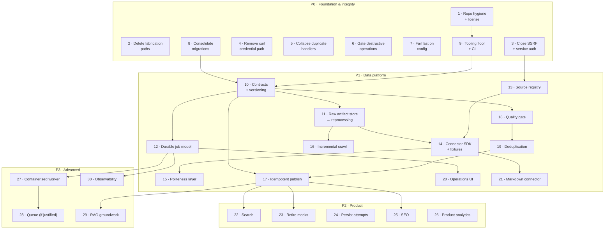

# Prepora — Engineering Roadmap

> Companion to [`docs/architecture/prepora-next-level-plan.md`](../architecture/prepora-next-level-plan.md).
> Finding numbers (#1–#27) refer to §4 of that document.
>
> **Ordered by dependency, not by feature area.** No dates. An item is ready when its dependencies
> are done, and every item names what "done" means so that readiness is checkable rather than
> negotiable.

---

## How to read this

Each item carries seven fields:

| Field | Meaning |
|---|---|
| **Goal** | What changes, stated as an outcome |
| **Why it matters** | The cost of not doing it, or what it unblocks |
| **Affected** | Packages and paths touched |
| **Depends on** | Items that must land first |
| **Notes** | Implementation guidance, including what to reuse |
| **Testing** | How correctness is established |
| **Done when** | Objective completion criteria |

**Priorities.** P0 is foundation and integrity — nothing downstream is trustworthy until it lands,
and most of it is deletion. P1 is the data platform, and is the substance of the project. P2 is
product work that depends only on the read path and can run in parallel with P1 from item 12 onward.
P3 is advanced infrastructure, gated on measured need.

---

## Dependency graph

---

# P0 — Foundation and integrity

*Almost entirely deletion and configuration. The goal is a repository that is safe to commit, safe
to run, and honest about what it does.*

---

### 1 · Repository hygiene and license

**Goal.** The repository is safe to commit to, legally clear, and runnable from a fresh clone.

**Why it matters.** `apps/scraper/`, `packages/api/` and `packages/auth/` have never been
committed — roughly two weeks and 4,200+ lines exist on one machine with no history and no backup.
Separately, `reactive-resume-repo/` (81 MB of third-party source) is untracked *and* unignored, so a
routine `git add .` commits another project into Prepora's history. And with no `LICENSE`, the
repository is "all rights reserved" by default, which contradicts the open-source goal.

**Affected.** `.gitignore`, `LICENSE`, `.env.example`, `README.md`, repository root.

**Depends on.** Nothing. *Do this first.*

**Notes.** Add `reactive-resume-repo/` and `apps/web/app.config.timestamp_*.js` to `.gitignore`
*before* staging anything. Commit the three untracked packages in coherent commits rather than one
bulk commit. Add MIT `LICENSE`. Add the four missing variables to `.env.example` —
`GOOGLE_CLIENT_ID`, `GOOGLE_CLIENT_SECRET`, `ADMIN_USERS`, `BETTER_AUTH_TRUSTED_ORIGINS` — since
without them the documented setup cannot work. Correct the README phase checklist, which marks
practice mode and community features complete while both are mock or unpersisted. Correct
`/api/llms-txt`, which advertises an `/mcp` endpoint that does not exist and lists exam domains
absent from the database (#21, `llms-txt.ts:17,21,26`) — for a repository meant to demonstrate
judgment, a claim that fails a one-minute check costs more than the missing feature would. Consider removing
`reactive-resume-repo/` entirely; `analysis_report.md` captured what it was for.

**Testing.** `git status` clean after commit; `git ls-files | wc -l` reflects the real tree;
fresh-clone smoke test — clone, `pnpm install`, copy `.env.example`, fill values, `pnpm dev` starts.

**Done when.** No untracked source remains; `LICENSE` exists; `.env.example` lists every variable
the application reads; the README and `llms.txt` describe only what exists; `reactive-resume-repo/` cannot be
committed by accident.

---

### 2 · Delete the content fabrication paths

**Goal.** A failed scrape produces an error, never invented content.

**Why it matters.** *This is the most damaging defect in the repository.* Three paths manufacture
content that is indistinguishable from real scraped material: the regex fallback invents options and
an answer key for every item (#2, `admin.router.ts:307-308`); when it finds nothing it inserts a
wholly fabricated question into the human review queue (#1, `admin.router.ts:319-325`); and the
public exams API substitutes a hardcoded sample set into live responses (#3,
`exams.router.ts:244-286`). A reviewer approving queue items in good faith can publish invented
answer keys. For a platform whose core asset is content trust, nothing else in this roadmap matters
while this remains.

**Affected.** `packages/api/src/routers/admin.router.ts`, `packages/api/src/routers/exams.router.ts`.

**Depends on.** Nothing.

**Notes.** Delete the Node fallback scraper entirely (`admin.router.ts:294-337`) rather than
repairing it — a regex over `
` tags is not a scraper, and the Python service is the extraction
path. When the scraper is unreachable, return a typed error the admin UI can display. Remove
`sampleAb100Questions` and let empty results be empty; the UI should render an honest empty state.
Audit for any remaining fallback that substitutes data rather than signalling failure.

**Testing.** Unit: trigger with the scraper stopped → typed error, zero rows written. Unit: exams
list with no matching data → empty array, not samples. Manual: confirm the review queue contains
only rows traceable to a real fetch.

**Done when.** No code path writes question content that did not come from a source document; a
failed scrape surfaces as an error in the admin UI; `grep -rn "Sample Extracted Question\|sampleAb100"`
returns nothing.

---

### 3 · Close the SSRF surface and authenticate the scraper service

**Goal.** The scraper fetches only URLs it is configured to fetch, and only authenticated callers
can ask it to.

**Why it matters.** `POST /scrape` accepts any caller-supplied URL and fetches it server-side with
no scheme allowlist, no host allowlist, no private-range denylist, and redirects followed (#4) — and
no endpoint on the service requires authentication (#5), with CORS `allow_origins=["*"]` alongside
`allow_credentials=True`. Anyone with network reach to port 8000 has a general "fetch any URL this
host can reach" primitive, including cloud metadata endpoints. The Node side has the same shape at
`admin.router.ts:299` and additionally trusts a caller-supplied `backendUrl` (`:250,261`).

**Affected.** `apps/scraper/main.py`, `packages/api/src/routers/admin.router.ts`,
`apps/web/app/routes/admin/scraping.tsx`, `.env.example`.

**Depends on.** Nothing. *Supersedes/feeds item 13 — the source registry later becomes the allowlist.*

**Notes.** Interim allowlist is a configured set of permitted hostnames; item 13 replaces it with the
registry, so keep the check behind one function. Reject non-`http(s)` schemes; resolve the hostname
and reject loopback, link-local (`169.254.0.0/16`), and RFC1918 ranges; disable redirect-following,
or re-validate the target after each hop. Add a shared service token (`PIPELINE_SERVICE_TOKEN`)
required on every endpoint. Replace wildcard CORS with the actual web origins. Remove the
caller-supplied `backendUrl` parameter — the scraper address is configuration, not input. Stop the
admin UI calling `localhost:8000` from the browser (`scraping.tsx:172,245`); route through oRPC.

**Testing.** Unit: `http://127.0.0.1/`, `http://169.254.169.254/`, `http://10.0.0.1/`, `file://`,
and a redirect to any of those are all rejected. Unit: request without a valid token → 401. Unit:
non-allowlisted host → rejected with a clear reason.

**Done when.** All five FastAPI endpoints require the service token; every outbound fetch passes the
allowlist and denylist; CORS names real origins; no browser code addresses the scraper directly;
`backendUrl` is no longer accepted from callers.

---

### 4 · Remove the curl credential path

**Goal.** Database access uses one configured client. No credential travels in an HTTP header to a
hardcoded host.

**Why it matters.** Before falling back to `psycopg2`, the crawler shells out to `curl` to POST SQL
at a hardcoded Neon hostname, passing the full `DATABASE_URL` as a request header (#6,
`ms_learn_catalog_crawler.py:690-716`). This pins one project's infrastructure into source, puts a
credential into a header sent to a fixed external host, and adds a subprocess dependency for
something the next twenty lines already do correctly.

**Affected.** `apps/scraper/ms_learn_catalog_crawler.py`, `apps/scraper/ms_learn_assessment_crawler.py`,
`apps/scraper/main.py`.

**Depends on.** Nothing.

**Notes.** Delete the curl branch; keep the `psycopg2` path. While here, consolidate the three
duplicated `INSERT INTO scraped_questions` statements into one helper — item 10 replaces it with the
contract layer, so a single call site makes that migration trivial. Rotate the Neon credential, since
it has been embedded in a command line and may appear in shell history or process listings.

**Testing.** Unit: the insert helper is the only place that writes staging rows. Manual: a crawl
persists correctly with no `subprocess` involvement. `grep -rn "curl\|subprocess" apps/scraper/`
returns nothing related to database access.

**Done when.** No hardcoded database hostname in source; no credential passed as an HTTP header; one
insert helper; credential rotated.

---

### 5 · Collapse duplicated handlers and remove debug scaffolding

**Goal.** One handler per concern, and no endpoint that reports secret metadata.

**Why it matters.** oRPC and auth are each implemented twice; `ssr.tsx` intercepts both before the
router dispatches (`ssr.tsx:40,58`), so `routes/api/orpc.$.ts` and `routes/api/auth.$.ts` are
maintained but unreachable (#18). Four near-identical `envAudit` blocks report secret *presence and
length* on any URL containing "health" or "debug" (#19) — length is a meaningful oracle. `isAdminUser`
is reimplemented in `useRBAC.ts:20-30` rather than reused (#20), creating a second copy of the
authorisation rule that can drift. All of this is sediment from one resolved production incident.

**Affected.** `apps/web/app/ssr.tsx`, `apps/web/app/routes/api/{orpc.$.ts,auth.$.ts,debugauth.ts,health.ts}`,
`apps/web/app/hooks/useRBAC.ts`, `packages/auth/src/index.ts`.

**Depends on.** Nothing.

**Notes.** Prefer the dedicated API routes and remove the `ssr.tsx` interception, since file-based
routes are the framework's idiom and are discoverable — but verify the Cloudflare environment-binding
sync still runs on every request, as that is what the interception was originally for. Delete
`/api/debugauth`. Reduce `/api/health` to a liveness check plus database reachability, with no secret
metadata. Have `useRBAC` call the canonical `isAdminUser` through a server function. Reconsider the
Better Auth `Proxy` wrapper (`packages/auth/src/index.ts:100-107`) now that binding resolution is
understood.

**Testing.** Integration: sign-in, session, sign-out still work; `/api/orpc` still serves. Unit: no
response body contains secret names, presence flags or lengths. `grep -rn "envAudit"` returns
nothing.

**Done when.** One oRPC handler, one auth handler, one admin-authorisation implementation; no debug
endpoint; environment binding still resolves correctly on Cloudflare.

---

### 6 · Gate destructive operations

**Goal.** Irreversible actions require deliberate confirmation and leave a record.

**Why it matters.** `wipeDatabase` TRUNCATEs eight tables CASCADE behind nothing more than the admin
check (#17, `admin.router.ts:66-77`) — no typed confirmation, no rate limit, and no entry in the
`auditLogs` table that exists for precisely this purpose. The UI calls it irreversible; the backend
treats it as an ordinary mutation.

**Affected.** `packages/api/src/routers/admin.router.ts`, `apps/web/app/routes/admin/settings.tsx`,
`packages/db/src/schema/analytics.ts` (first real use of `auditLogs`).

**Depends on.** Nothing. *This is the first write to `auditLogs`, establishing the pattern item 25
extends.*

**Notes.** Require a typed confirmation phrase in the request body, validated server-side. Write an
`auditLogs` row with actor, action, and affected counts *before* executing. Refuse entirely when
`NODE_ENV === "production"` unless an explicit environment flag permits it. Apply the same audit
pattern to `processReviewItem`, since approval is also a content-affecting privileged action.

**Testing.** Unit: wrong or missing confirmation → rejected, nothing truncated. Unit: successful wipe
writes exactly one audit row with correct actor and counts. Unit: production without the override →
refused.

**Done when.** No destructive endpoint executes without typed confirmation; every privileged
content-affecting action writes an audit row; `auditLogs` has non-zero rows in normal operation.

---

### 7 · Fail fast on configuration

**Goal.** A missing environment variable fails at startup with a clear message, never mid-request.

**Why it matters.** `packages/db/src/client.ts:32` resolves `db` to `{} as any` when `DATABASE_URL`
is absent (#22), so a configuration error surfaces as `TypeError: db.select is not a function` deep
inside a request. The same permissiveness appears in the auth package, which logs errors for missing
secrets and constructs an instance anyway.

**Affected.** `packages/db/src/client.ts`, `packages/auth/src/index.ts`, `apps/scraper/main.py`.

**Depends on.** Nothing.

**Notes.** Validate required configuration once at module load with a Zod schema, throwing a message
that names the missing variable and points at `.env.example`. Remove the `{} as any` fallback. In
Python, validate with Pydantic Settings at import. Keep the distinction between genuinely optional
configuration (storage, AI keys) and required configuration (database, auth secret).

**Testing.** Unit: unset `DATABASE_URL` → startup throws naming the variable. Unit: complete
environment → starts clean. Manual: the error message is actionable without reading source.

**Done when.** No `as any` configuration fallback; every required variable is validated at startup;
error messages name the variable and the fix.

---

### 8 · Consolidate schema migrations into Drizzle

**Goal.** One migration mechanism. Schema state is reproducible from the repository.

**Why it matters.** Four hand-written scripts alter schema outside the Drizzle journal (#24):
`create_scraped_table.ts` issues raw DDL for a table Drizzle already defines, `migrate.js` and
`migrate-accounts.mjs` apply `ALTER TABLE` fix-ups with errors swallowed, and `clean.mjs` TRUNCATEs
`users` CASCADE. Environments that ran one mechanism and not the other are silently divergent, and
nothing detects the divergence.

**Affected.** `packages/db/{clean.mjs,migrate.js,migrate-accounts.mjs}`,
`packages/db/src/create_scraped_table.ts`, `drizzle/`.

**Depends on.** Nothing. *Blocks item 10, since the pipeline contracts must target a known schema.*

**Notes.** Because the database holds only scratch data, the cleanest path is to verify the Drizzle
schema is complete, regenerate from a clean database, and delete all four scripts. Replace `clean.mjs`
with a documented `db:reset` script that drops and re-migrates, clearly marked development-only.
Check in a `drizzle-kit check` result so drift becomes visible.

**Testing.** Drop a scratch database, run `pnpm db:migrate`, confirm the resulting schema matches
`packages/db/src/schema/`. CI runs `drizzle-kit check` on every pull request.

**Done when.** The four ad-hoc scripts are gone; a fresh database reaches current schema through
Drizzle alone; drift is detected in CI.

---

### 9 · Tooling floor and CI

**Goal.** Lint, format, typecheck and tests run locally and in CI, on every change.

**Why it matters.** There are zero tests, no `vitest.config.*` and no `playwright.config.*` despite
both being scripted and installed, and `pnpm lint` is a no-op because no package defines a `lint`
script and no ESLint or Biome configuration exists (#25). There is no CI at all (#26). Every
subsequent item in this roadmap needs a correctness signal; right now there is none.

**Affected.** Repository root, every package, `.github/workflows/`.

**Depends on.** Item 1 (commit the untracked packages first, so CI has something to check).

**Notes.** Use Biome for lint and format — one tool, one config, fast, and it removes the
ESLint/Prettier decision entirely. Add `vitest.config.ts` at the root with workspace projects, and
`playwright.config.ts` for end-to-end tests. Add `lint` and `typecheck` scripts to `packages/api` and
`packages/auth`, which currently have no scripts at all. For Python, add `ruff` and `pytest`. The CI
workflow runs lint, typecheck, unit tests and `drizzle-kit check` on pull requests; keep it under
five minutes so it is actually used. Seed the suite with tests for the `packages/content` logic that
item 18 will port — they document current behaviour before it moves.

**Testing.** The workflow is itself the test: it must fail on an intentionally broken commit and pass
on `main`.

**Done when.** `pnpm lint`, `pnpm typecheck` and `pnpm test` all do real work and pass; CI runs on
every pull request; a deliberate type error fails the build.

---

# P1 — The data platform

*The substance of the project. Each item leaves the system working.*

---

### 10 · Pipeline contracts and version stamping

**Goal.** Every stage boundary is a typed, versioned contract.

**Why it matters.** Today each handler independently constructs its own dictionary shape, so
consistency depends on developer discipline rather than enforcement, and there is no seam at which
to test a stage in isolation. Contracts are what make stages separable, testable and reprocessable —
every other P1 item depends on them.

**Affected.** `apps/pipeline/prepora_pipeline/contracts/` (new).

**Depends on.** Items 8, 9.

**Notes.** Five Pydantic models: `RawArtifact` → `ExtractedQuestion` → `NormalizedQuestion` →
`ValidatedQuestion` → `CanonicalQuestion`. Stamp `contract_version`, `parser_version` and
`pipeline_version` on every record — this is what makes a run reproducible and makes "why did this
question change?" answerable. Derive the target shape from `packages/content/src/schema.ts`, which
already encodes the right model: single-letter option keys, a discriminated-union answer, slugged
identifiers. Mind the shape mismatch documented in §6 of the architecture assessment — the scraper
emits `options: string[]` and a free-text answer, and bridging that is the normalizer's job, not the
contract's.

**Testing.** Unit: each contract rejects malformed input with a useful message. Round-trip:
serialise and deserialise preserves every field. Conformance: a `CanonicalQuestion` maps cleanly onto
the Drizzle schema — this is the R1 mitigation and must run in CI.

**Done when.** All five contracts exist with version stamping; the schema-conformance test runs in
CI; no stage accepts or returns an untyped dictionary.

---

### 11 · Raw artifact store and reprocessing

**Goal.** Every fetch is stored in full and immutably. A parser fix replays stored artifacts instead
of re-crawling.

**Why it matters.** *This is the highest-value item in the roadmap.* Raw HTML is truncated to 2000
characters (#7, `main.py:183`) and the Playwright path stores a description string rather than markup
(`ms_learn_catalog_crawler.py:695`), so reprocessing is impossible and every parser improvement costs
a full re-scrape — which for the authenticated Microsoft Learn flow means re-driving a browser
session. This is why connector development currently has no fast feedback loop, and it is the
capability the brief identifies as particularly important.

**Affected.** `apps/pipeline/prepora_pipeline/core/artifact_store.py` (new), `packages/db/src/schema/`
(new `raw_artifacts` table), `drizzle/`.

**Depends on.** Item 10.

**Notes.** Content-address by SHA-256; store under `.data/raw/<prefix>/<hash>` locally. The
`raw_artifacts` row records hash, source id, URL, fetched-at, content type, HTTP status, and storage
key. Define the store as an interface with a filesystem implementation so S3/R2 is a second
implementation rather than a refactor (§16, guarantee 3). Artifacts are immutable — a changed page is
a new artifact, which is what makes change detection in item 16 nearly free. Add
`prepora pipeline reprocess --source X --from <date>` to replay stored artifacts through the current
parser. Add a retention policy so the store does not grow without bound.

**Testing.** Unit: identical content stores once (hash dedupe). Unit: reprocessing a stored artifact
with a modified parser produces the new output with no network access — assert this with network
disabled. Integration: fetch → store → reprocess round-trip.

**Done when.** Every fetch persists its full payload; `raw_artifacts` is populated; a parser change
can be validated against stored artifacts offline; retention is configured.

---

### 12 · Durable job model

**Goal.** Every pipeline run is a database record with per-stage detail and full history.

**Why it matters.** Job state is a module-level in-memory `set()` (#8, `main.py:114`) plus a tail of
`/tmp/ms_learn_scraper.log` (`ms_learn_catalog_crawler.py:20`). State resets on restart, is not shared
across workers, and the duplicate-suppression path returns `db_saved: True` having saved nothing
(`main.py:118-122`). There is no way to answer "what happened to job X". This item is also what makes
the admin scraping console work against a deployed instance, since it stops depending on a local file.

**Affected.** `packages/db/src/schema/` (new `pipeline_jobs`, `pipeline_job_stages`),
`apps/pipeline/prepora_pipeline/core/jobs.py` (new), `packages/api/src/routers/admin.router.ts`.

**Depends on.** Item 10.

**Notes.** `pipeline_jobs`: id, source_id, job_type, status (`queued|running|completed|partial|failed|cancelled`),
trigger_type, requested_by, configuration, timestamps, error summary. `pipeline_job_stages`: job_id,
stage, status, counts (discovered, processed, failed, duplicate, skipped), duration, error detail.
Per-stage counters give the stage-breakdown view in item 20 for free. Structured logs carry the job
id so file logs become a debugging aid rather than the source of truth. Replace `seen_jobs` with a
database-backed idempotency key. Job state in Postgres is §16 guarantee 2 — it is what lets any
number of workers be observed from one UI.

**Testing.** Unit: a failing stage marks the job `partial` or `failed` with the error recorded. Unit:
re-submitting the same idempotency key does not double-run. Integration: a full run produces one job
row and one row per stage with correct counts.

**Done when.** Every run has a durable record; the admin UI reads job state from the database; no
in-memory job state; `/tmp` log tailing is gone.

---

### 13 · Source registry

**Goal.** Sources are configuration, not code. The registry is also the fetch allowlist.

**Why it matters.** Handlers are registered in a hardcoded order-sensitive list
(`handlers/__init__.py:10-16`) and the admin UI holds a parallel static registry of six sites in
component source (`scraping.tsx:43-122`). Neither records crawl policy, rate limits, authentication
requirements, robots review status, or crawl history. Making the registry the single source of truth
also closes the SSRF surface properly — the configuration model and the security boundary become one
mechanism rather than two that can disagree.

**Affected.** `packages/db/src/schema/` (new `sources`), `apps/pipeline/prepora_pipeline/core/registry.py`
(new), `apps/pipeline/prepora_pipeline/connectors/*/source.yaml` (new),
`apps/web/app/routes/admin/scraping.tsx`.

**Depends on.** Item 3.

**Notes.** Per source: id, name, base URL, source type, connector name, authentication requirement,
crawl policy (depth, max pages), rate limit, robots/terms review status, enabled flag, last crawl,
last *successful* crawl, consecutive failures. Static definition in per-connector YAML; mutable
operational state in the table. The allowlist from item 3 now derives from `base_url` of enabled
sources. Remove the hardcoded list from `scraping.tsx` and drive the UI from the registry.

**Testing.** Unit: a URL outside every enabled source's base URL is rejected. Unit: a disabled source
cannot be triggered. Integration: adding a YAML file makes the source appear in the admin UI with no
code change.

**Done when.** No hardcoded source list in Python or TypeScript; the fetch allowlist derives from the
registry; the admin UI lists sources from the database.

---

### 14 · Connector SDK with fixtures and contract tests

**Goal.** Adding a source means adding one directory. Website changes cannot silently corrupt the
dataset.

**Why it matters.** `BaseScraperHandler` specifies method names but not output shape
(`handlers/base.py:5-23`), so each handler independently builds its own dictionary. `discover_next_links`
is implemented on all six handlers and called by nothing (#9) — pagination does not exist despite the
abstraction for it. There are no fixtures and no tests, so a site redesign corrupts extraction
silently. Contract tests are the brief's §38 requirement and the main defence for a scraping platform.

**Affected.** `apps/pipeline/prepora_pipeline/connectors/` (new), `apps/scraper/handlers/` (migrated
then removed), `docs/connectors/` (new authoring guide).

**Depends on.** Items 10, 11, 13.

**Notes.** Each connector directory holds `connector.py` (discover, fetch), `parser.py` (extract),
`normalizer.py` (map to the shared contract), `fixtures/` (captured real responses), `test_parser.py`
(fixture → expected `CanonicalQuestion`), and `README.md`. **Wire up `discover`** — the methods exist
and just need a caller. Migrate the five handlers one at a time, capturing fixtures from stored raw
artifacts (item 11 makes this free). Microsoft Learn is the hardest case because of Playwright and
authentication; do it last, and treat it as one connector among several rather than the reference
implementation (architecture assessment R3). Delete `apps/scraper/` once the last handler has moved.
Write the authoring guide as the tenth step of the first migration, while the friction is fresh.

**Testing.** Contract test per connector: fixture in, expected canonical output out, asserted exactly.
Unit: discover returns expected pagination links from a fixture. CI runs every contract test — a
parser regression must fail the build.

**Done when.** All five sources are connectors with fixtures and passing contract tests; discover is
called and pagination works; a new source needs no edits outside its own directory; the authoring
guide is followed end to end by someone who did not write it.

---

### 15 · Politeness and resilience layer

**Goal.** The crawler is well-behaved by default and survives transient failure.

**Why it matters.** There are no retries, no backoff, no rate limiting, no concurrency control and no
`robots.txt` handling anywhere. The user-agent is a hardcoded Chrome string duplicated in three
places, none of which identifies the crawler. A single failed request raises immediately, so one bad
page can end a whole job. For a public-source scraping platform this is both an operational and an
ethical gap.

**Affected.** `apps/pipeline/prepora_pipeline/core/{http_client,rate_limiter,robots}.py` (new).

**Depends on.** Item 14.

**Notes.** One HTTP client used by every connector, carrying per-source rate limiting from the
registry, bounded exponential backoff with jitter, a retry budget, connect and read timeouts, and a
concurrency cap per domain. Honest configurable user-agent identifying the crawler with a contact
URL. Fetch and honour `robots.txt`, caching per domain. Partial failure is normal: one bad page
records a stage error and the job continues as `partial`. **Do not** build anything that evades
anti-bot measures — a source that requires evasion is a source to disable in the registry.

**Testing.** Unit: rate limiter enforces the configured interval. Unit: retries stop at the budget
and back off correctly. Unit: a disallowed path is not fetched. Integration: a job with one failing
page completes as `partial` with the failure recorded.

**Done when.** Every fetch goes through the shared client; rate limits come from the registry; robots
is honoured; the user-agent identifies Prepora; one bad page never fails a whole job.

---

### 16 · Incremental crawling and change detection

**Goal.** Unchanged content is skipped. Changes are classified and visible.

**Why it matters.** There is no hashing, no conditional requests and no `last_seen` tracking, so every
crawl is a cold full re-fetch and every re-scrape of the same URL appends another staging row —
there is no `ON CONFLICT` anywhere. This wastes source bandwidth, makes politeness harder, and makes
content freshness unmeasurable.

**Affected.** `apps/pipeline/prepora_pipeline/stages/`, `packages/db/src/schema/` (`raw_artifacts`
extensions, source state).

**Depends on.** Item 11.

**Notes.** Item 11 already computes a content hash, so most of this is comparison logic. Send
`If-None-Match` and `If-Modified-Since` where the source supplies validators; store ETag and
`Last-Modified` alongside the artifact. Classify each discovered resource as `new`, `changed`,
`unchanged` or `removed`, record counts per stage, and skip processing for `unchanged`. `removed`
flags for review rather than deleting — a source going dark should not silently unpublish content.
Produce a diff for `changed` resources so a reviewer can see what moved.

**Testing.** Unit: identical content on a second crawl classifies `unchanged` and skips downstream
stages. Unit: modified content classifies `changed` and produces a diff. Unit: a resource absent from
discovery classifies `removed` and flags rather than deletes.

**Done when.** A second crawl of unchanged content performs no downstream work; per-job counts show
new/changed/unchanged/removed; freshness per source is queryable.

---

### 17 · Idempotent, occurrence-aware publishing

**Goal.** Publishing twice produces the same result. Published questions are connected to the catalog.

**Why it matters.** Approval generates a random four-character slug suffix (#10,
`admin.router.ts:194`), matches answers by exact string equality against option text (#11, `:211`),
and never populates `questionOccurrences`, `topicId` or any `questionSets` link — so published
questions float disconnected from the exam, subject and topic pages that are supposed to reach them.
Meanwhile `stableContentId` exists with a unique constraint (`questions.ts:28`) and is unused. This
item finally uses the canonical/occurrence model the schema has had since the first migration.

**Affected.** `apps/pipeline/prepora_pipeline/stages/publish.py` (new),
`packages/api/src/routers/admin.router.ts` (approval delegates to the pipeline).

**Depends on.** Items 10, 19.

**Notes.** Derive `stable_content_id` deterministically from source, exam, variant, year and original
question number — following the convention already documented in `agents/content/schema.md:177-189`.
Upsert on it. Resolve the answer by option *key*, carried through the contract from the normalizer,
never by string equality on option text. Create or resolve exam, variant, subject and topic rows, and
write a `questionOccurrences` row for each appearance. Re-publishing an existing canonical question
seen in a new paper adds an occurrence rather than a question — this is the payoff of item 19.

**Testing.** Unit: publishing the same content twice produces one question row and one occurrence.
Unit: the same question in two exam years produces one question and two occurrences. Unit: every
published question resolves to a topic and is reachable from its exam and subject page. Integration:
full pipeline run then re-run is a no-op.

**Done when.** Publishing is idempotent on `stable_content_id`; occurrences are populated; every
published question is reachable through the catalog; answer keys never depend on string equality.

---

### 18 · Quality gate

**Goal.** Deterministic rules decide what may be published, and the human-review flag actually works.

**Why it matters.** The scrape path has no validation at all. A good validator exists in TypeScript
and is connected to nothing. Worse, `FLAG FOR HUMAN REVIEW` — the safety mechanism the content rules
mandate (`agents/content/rules.md:27-38`) — is not recognised by the parser: it parses as an ordinary
text answer (#12, `parser.ts:43`) and **passes validation**, because the missing-answer rule only
fires when the answer is absent entirely. The documented safety net does not function.

**Affected.** `apps/pipeline/prepora_pipeline/stages/validate.py` (new), ported from
`packages/content/src/validate.ts`.

**Depends on.** Item 10.

**Notes.** Port the seven existing rules — they are well-chosen and deterministic. Then fix the flag
defect: detect `FLAG FOR HUMAN REVIEW` explicitly and route to quarantine, never to publish. Add the
rules the current validator lacks: `multiple_correct` answers are never checked against available
options (only `mcq` is); slugs are never validated against a registry; `stableContentId` uniqueness is
never checked beyond a single file. Every failure records a reason and quarantines rather than
discarding, so the material remains inspectable. Deterministic validation stays authoritative — any
future AI-assisted checks advise, they do not decide. Track a confidence label
(`verified | source-confirmed | needs-review | community-reported | ambiguous`) but do not surface a
numeric score to students, since an arbitrary score has no defensible interpretation.

**Testing.** Port the `packages/content` test cases written in item 9. Unit: a `FLAG FOR HUMAN REVIEW`
answer quarantines and never publishes — this is the regression test for the defect. Unit: each rule
fires on a crafted failing input and passes a valid one. Unit: a quarantined record retains its
reason and is queryable.

**Done when.** No content publishes without passing the gate; the flag defect has a passing
regression test; every quarantined item has a machine-readable reason; validation is deterministic
and reproducible.

---

### 19 · Deduplication subsystem

**Goal.** Distinguish a duplicate record from the same question legitimately appearing in a different
exam or year.

**Why it matters.** The current deduplicator compares only within a single file (#13,
`duplicates.ts:65`, `check-duplicates.ts:33`) and receives a bare `Question[]` with no exam or year
context, so it *structurally cannot* make the distinction the brief calls extremely important — a
question repeated in the 2023 and 2024 papers lives in two files and is never even compared. The
review queue's `ilike` check (`admin.router.ts:143`) is a separate, weaker second implementation.

**Affected.** `apps/pipeline/prepora_pipeline/stages/dedupe.py` (new), ported and extended from
`packages/content/src/duplicates.ts`.

**Depends on.** Item 18.

**Notes.** Port the existing two-stage approach — normalised content hash for exact matches, then
Levenshtein similarity at 0.9 for near matches (`duplicates.ts:66-101`). Then extend it in the two
ways it currently cannot go: compare **across** sources and files, not within one file, using a
hash index so the comparison is not O(n²) over the whole corpus; and carry exam, variant and year
through the contract so the decision can be made. Three outcomes: exact duplicate within the same
paper → drop with a reason; same question in a different exam or year → one canonical question plus
a new occurrence (item 17); near-duplicate below confidence → flag for human review, never auto-merge.
Preserve the existing design principle, which the content rules state explicitly: never merge
silently. Retire the separate `ilike` check so there is one implementation.

**Testing.** Unit: byte-identical questions in the same paper → exact duplicate. Unit: the same
question in 2023 and 2024 → one canonical, two occurrences (the defining test for this item). Unit:
near-duplicates at 0.92 → flagged, not merged. Performance: dedupe against a 50,000-question corpus
completes within a documented bound.

**Done when.** Deduplication works across sources and years; legitimate repeats become occurrences;
nothing merges without human confirmation; one implementation remains.

---

### 20 · Admin operations UI on real data

**Goal.** The admin surface shows what the pipeline actually did, sourced from the database.

**Why it matters.** The scraping console tails a `/tmp` file through a proxy and calls `localhost:8000`
directly from the browser, so it cannot work against a deployed instance. With items 12 and 13
landed, real job and source data exists; this item surfaces it. The brief's §31–32 source-health and
job-inspection views become mostly presentation work.

**Affected.** `apps/web/app/routes/admin/scraping.tsx`, `apps/web/app/routes/admin/review.tsx`,
`packages/api/src/routers/admin.router.ts`, new admin operations routes.

**Depends on.** Items 12, 13.

**Notes.** Separate the admin information architecture into Content, Pipeline, Review and Analytics
as the brief describes — the sidebar currently lists eleven destinations of which six have no route
(`admin.tsx:60-72`). Source health: last successful crawl, consecutive failures, average runtime,
error rate. Job inspection: per-stage counts and durations, drawn from `pipeline_job_stages`. Remove
every `localhost:8000` literal from the UI. Add a server-side batch endpoint for review actions —
`review.tsx:189-213` currently loops sequential round-trips. Extract the question-text cleanup logic
duplicated between `practice.tsx:63-159` and `admin/review.tsx:43-154` into one shared module.

**Testing.** Integration: a completed job renders with correct per-stage counts. Integration: a source
with recent failures shows as degraded. E2E: trigger a job against a fixture source and watch it
through to completion in the UI.

**Done when.** No `localhost` literal in the web app; job and source views read from the database;
review batch actions are one request; admin sections match the documented information architecture.

---

### 21 · Markdown as a connector

**Goal.** Markdown content enters through the same pipeline as every other source.

**Why it matters.** `scripts/import-content.ts` never writes to the database (#14) — the canonical
import path is a commented-out stub referencing an `importQuestionSet` function that does not exist,
and `content/` holds only a README. Meanwhile the Markdown format spec, the Content Agent brief and
the content rules are genuinely good design work. Making Markdown a connector preserves all of that
while removing the parallel half-pipeline, and it keeps the format meaningful after `packages/content`
stops being the write path.

**Affected.** `apps/pipeline/prepora_pipeline/connectors/markdown/` (new),
`scripts/import-content.ts` (removed), `packages/content/` (format spec retained).

**Depends on.** Item 14.

**Notes.** Port `parser.ts` to Python as the Markdown connector's extractor, preserving the format
contract in `agents/content/schema.md` exactly. Fix the two documented drifts while porting: `**Tags:**`
is specified but never parsed, and `FLAG FOR HUMAN REVIEW` is not recognised (item 18 covers the
latter). Discovery walks `content/**/*.md`; fetch reads the file; the content hash gives change
detection for free. Contributions submitted as Markdown then flow through the same validation,
deduplication and publishing as scraped content — one quality gate for all content regardless of
origin. Keep `packages/content` in the repository for the format spec and the reference
implementation; mark clearly that Python is the executing path.

**Testing.** Contract test: the two example files in `agents/content/examples/` parse to expected
canonical output. Unit: `**Tags:**` now parses. Unit: a flagged question quarantines. Integration:
a Markdown file placed in `content/` is discovered, validated and published by a normal pipeline run.

**Done when.** Markdown imports through the pipeline; `import-content.ts` is deleted; the example
files publish end to end; one quality gate serves every content source.

---

# P2 — Product

*Depends on the read path only. Can run in parallel with P1 from item 12 onward.*

---

### 22 · Search

**Goal.** Search returns real results from the database, behind an interface that survives an engine
change.

**Why it matters.** `/search` renders a hardcoded object of two fake questions, one fake topic and
one fake exam (#15, `search.tsx:23-31`); the query parameter is read only to display it in a heading
and never sent anywhere. The ⌘K palette is likewise hardcoded. There is no search router, no
`tsvector`, no index, and `searchQueries` is never written. Search is the primary discovery path for
an SEO-first platform.

**Affected.** `packages/api/src/routers/search.router.ts` (new),
`apps/web/app/routes/search.tsx`, `apps/web/app/components/search/SearchCommandModal.tsx`,
`packages/db/src/schema/` (full-text indexes).

**Depends on.** Item 17 (real published content to search).

**Notes.** Postgres full-text search is sufficient for the foreseeable corpus and needs no new
infrastructure — this is ADR-006. What matters is the seam: define a `SearchProvider` interface with
`searchQuestions`, `searchExams`, `searchTopics` so Meilisearch, Typesense or a vector index later
become implementations rather than a rewrite. Add generated `tsvector` columns with GIN indexes;
weight question text above explanation. Log every query to `searchQueries` with result count and
clicked result — this is both product analytics and the data that tells you what content is missing.

**Testing.** Unit: a known question is findable by a distinctive phrase. Unit: zero-result queries
return empty and are logged. Performance: p95 latency under a documented bound on a realistic corpus.
E2E: search from the palette through to a question page.

**Done when.** Search returns database results; the provider interface is the only access path;
queries are logged; no hardcoded results remain.

---

### 23 · Retire the mock datasets

**Goal.** Every page renders real data or an honest empty state.

**Why it matters.** Seven independent hardcoded datasets exist (#27), with the same
Strength-of-Materials questions recurring near-verbatim across at least three files. A reader cannot
tell which parts of the product work, and neither can a contributor. This is the visible half of the
same problem as item 2.

**Affected.** `apps/web/app/routes/{topics/$topicSlug,questions/...,search}.tsx`,
`apps/web/app/routes/admin/contributions.tsx`, `apps/web/app/components/search/SearchCommandModal.tsx`.

**Depends on.** Items 17, 22.

**Notes.** Replace each mock with a real query, or with a designed empty state where the feature is
genuinely not built yet — an honest "no content yet" is better than convincing fiction.
`admin/contributions.tsx` simulates its entire CRUD in local React state (`contributions.tsx:23-73`)
and needs real endpoints. If fixtures are still wanted for development, put them in one clearly
named module that cannot be imported by production code paths.

**Testing.** E2E: each page against an empty database renders its empty state without error. E2E:
each page against seeded data renders that data. Lint rule or CI grep forbidding fixture imports in
route files.

**Done when.** No route imports hardcoded question data; every page has a tested empty state; the
admin contributions page reads and writes real rows.

---

### 24 · Persist practice attempts

**Goal.** Practice results survive a refresh and accumulate into progress.

**Why it matters.** `attempts` and `practiceSessions` are fully migrated and never written to (#16).
Practice mode keeps everything in React state (`practice.tsx:239-253`) and scores client-side, so
results vanish on navigation. `questions.submitAnswer` already exists as an authenticated oRPC
procedure that scores server-side (`questions.router.ts:41-76`) and has zero call sites — its own
comment records the gap. Without persistence there is no progress tracking, no weak-topic analysis,
and nothing for a future study assistant to personalise against.

**Affected.** `apps/web/app/routes/practice.tsx`, `packages/api/src/routers/questions.router.ts`.

**Depends on.** Item 17.

**Notes.** Call the existing `submitAnswer` procedure and extend it to write `attempts`. Create a
`practiceSessions` row at start and finalise it on completion. Support anonymous sessions via the
`sessionId` column the schema already provides, so practice works signed-out and can be claimed on
sign-in. Move scoring server-side to make it authoritative. Keep the interaction optimistic so the
UI stays responsive.

**Testing.** Unit: a submitted answer writes exactly one attempt with correct scoring. Unit: an
anonymous session persists and is claimable. E2E: complete a practice session, refresh, results
persist.

**Done when.** `attempts` and `practiceSessions` accumulate rows in normal use; scoring is
server-authoritative; results survive refresh; anonymous practice works.

---

### 25 · SEO completion

**Goal.** Question pages are independently discoverable, with correct structured data on one domain.

**Why it matters.** Per-route metadata is already good, but there is no JSON-LD and no canonical tag
anywhere (#23). `sitemap.xml` references `sitemap-question-sets.xml` and `sitemap-questions.xml`
which the generator never creates — broken links in the live sitemap index. The generators emit
hardcoded demo data with future-dated entries and are not wired into the build. Three production
domains appear across the repository: `prepora.in` in `robots.txt:4`, `prepora.xpar.in` and
`prepora-9g4.pages.dev` in `packages/auth/src/index.ts:11-12`. For a platform whose primary strategy
is organic discovery, this is core product work, not polish.

**Affected.** `scripts/generate-sitemap.ts`, `scripts/generate-rss.ts`, route `head` definitions,
`apps/web/public/robots.txt`, `packages/auth/src/index.ts`.

**Depends on.** Item 17.

**Notes.** Settle on one canonical production domain and make every reference agree. Generate
sitemaps from the database, including the two missing files, and wire generation into the build so
they cannot drift. Add JSON-LD: `Quiz`/`Question` on question pages, `Course` or `EducationalOccupationalProgram`
on exam pages, `BreadcrumbList` throughout. Add canonical link tags, which matter because the same
question is reachable from topic, subject and exam paths. Strengthen internal linking between
related questions, topics and years — this is also what makes the knowledge graph navigable.

**Testing.** Validate JSON-LD against Google's Rich Results test. Unit: sitemap generation covers
every published question and references only files it creates. CI: assert one canonical domain across
the repository.

**Done when.** Every published question appears in a database-generated sitemap; structured data
validates; canonical tags are present; one domain is used everywhere.

---

### 26 · Product analytics

**Goal.** Product behaviour is measured.

**Why it matters.** `analyticsEvents` is dead schema (#16). Without it there is no way to know which
content is used, which searches fail, or where students drop out — and no data-driven basis for
deciding what to scrape next. Pipeline metrics arrive with item 12; this is the product half.

**Affected.** `packages/api/src/routers/analytics.router.ts` (new), route-level instrumentation.

**Depends on.** Items 22, 24.

**Notes.** Instrument the events the schema anticipates: page view, search, result click, question
view, answer reveal, practice start and completion, bookmark, contribution, report. Keep anonymous
analytics strictly separate from authenticated user data, as the brief requires — collect no more
than is needed, and prefer a rotating session identifier to anything that identifies a person.
Batch client-side to avoid a request per interaction. Document what is collected in `SECURITY.md` or
a privacy note before shipping.

**Testing.** Unit: each event type writes correctly. Unit: anonymous events carry no user identifier.
Integration: a session produces the expected event sequence.

**Done when.** `analyticsEvents` accumulates rows; the admin analytics view reads real data; what is
collected is documented; anonymous and authenticated data are separated.

---

# P3 — Advanced infrastructure

*Gated on measured need. Each item requires an ADR answering: problem, why this technology, why not
the simpler alternative, trade-offs.*

---

### 27 · Containerised worker and scheduler

**Goal.** The pipeline runs in the cloud without code changes.

**Why it matters.** The confirmed decision is local-only for now. This item exists so that decision
stays cheap to revisit — and it is only correct once items 12, 13 and 11 have delivered the four
guarantees in §16 of the architecture assessment: CLI entry point, job state in Postgres, artifact
store behind an interface, and fully environment-driven configuration.

**Affected.** `apps/pipeline/Dockerfile` (new), `docker-compose.yml` (new), deployment configuration.

**Depends on.** Items 11, 12, 13.

**Notes.** Recommended target is Architecture A from §16 — web stays on Cloudflare Pages, workers run
as containers on a container host against the same Neon database, with artifacts moving to R2 or
S3 (the `STORAGE_*` variables already exist in `.env.example`). Docker Compose gives contributors a
one-command local environment mirroring it. Start with scheduled runs; add a persistent worker only
if on-demand triggering demands it.

**Testing.** The container runs the same contract tests as local. Integration: a scheduled run
completes and records a job row. Verify local and containerised runs produce identical output for the
same fixture.

**Done when.** The pipeline runs in a container with no source changes; Compose reproduces the system
locally; artifacts persist to object storage; a scheduled run completes end to end.

---

### 28 · Job queue — if and when justified

**Goal.** Concurrent jobs are coordinated across workers.

**Why it matters.** Postgres-backed job state (item 12) with `SELECT … FOR UPDATE SKIP LOCKED` handles
far more concurrency than this project is likely to need. **Do not build this until a measured limit
is hit.** The brief is explicit that infrastructure added for appearance is a negative signal.

**Affected.** `apps/pipeline/prepora_pipeline/core/queue.py`.

**Depends on.** Item 27, plus evidence.

**Notes.** The ADR must state the measured limit that justified moving beyond Postgres. If that
evidence does not exist, the correct outcome is an ADR recording the decision *not* to add a queue —
which is itself a stronger signal of judgment than adding one.

**Testing.** Concurrency: N workers process a job set with no double-processing and no starvation.

**Done when.** Either a queue exists with measurements justifying it, or an ADR records why Postgres
remains sufficient.

---

### 29 · RAG groundwork

**Goal.** The retrieval layer can be added without reworking the pipeline.

**Why it matters.** The chatbot is out of scope, but foreclosing it would be a design error. The
provenance and versioning fields it needs are already required by P1 for debugging and auditing — see
§22 of the architecture assessment.

**Affected.** `apps/pipeline/prepora_pipeline/stages/embed.py` (new), `packages/db/src/schema/`.

**Depends on.** Item 17.

**Notes.** Embedding is a pipeline stage consuming the same contracts and carrying the same version
stamps, not a side system — when the model changes, that is a reprocessing run. Chunk at question
granularity, which the content model already provides. `pgvector` is the obvious first store and needs
no new infrastructure. Retrieval must read only published canonical content, never staging, never
quarantine, never the live web. Citations derive from provenance fields the pipeline already stamps.

**Testing.** Unit: an embedded chunk retains full provenance. Unit: unpublished content is never
embedded. Integration: retrieval returns only published content with resolvable citations.

**Done when.** Embedding runs as a versioned stage; every chunk carries citable provenance; retrieval
cannot reach unpublished content.

---

### 30 · Observability

**Goal.** Operational questions are answerable without reading source.

**Why it matters.** Item 12 already delivers job durations, failure rates, source health and pipeline
throughput from the job tables — which covers most of what the brief asks for. This item adds only
what those tables cannot answer.

**Affected.** `apps/pipeline/prepora_pipeline/core/telemetry.py`, `packages/api`.

**Depends on.** Item 12.

**Notes.** Structured JSON logs with job id correlation first — cheapest and highest value. Add
OpenTelemetry tracing only where a trace answers a question logs cannot, most plausibly cross-service
latency between web, API and pipeline. Error tracking (Sentry or equivalent) is worth it early
because it catches what nobody thought to log. Resist assembling a full metrics stack for a
single-worker local pipeline; the ADR must justify each component against the job tables already in
place.

**Testing.** Unit: logs are parseable JSON carrying job id. Integration: a traced request produces a
complete span tree across services.

**Done when.** Logs are structured and correlated; errors are tracked; every added component has an
ADR explaining why the job tables were insufficient.

---

## Documentation, delivered alongside

Not a phase — written as the work lands, while the detail is fresh.

| Document | Written with | Contents |
|---|---|---|
| `LICENSE` | Item 1 | MIT |
| `README.md` (rewrite) | Item 1, revised at each phase | What Prepora is, why, architecture, stack, pipeline, local setup, testing, contribution, roadmap |
| `CONTRIBUTING.md` | Item 9 | Setup, conventions, test expectations, PR process |
| `SECURITY.md` | Item 3 | Reporting policy, scraping ethics, data handling |
| `CODE_OF_CONDUCT.md` | Item 1 | Standard adoption |
| `docs/connectors/authoring-guide.md` | Item 14 | The ten-step process for adding a source |
| `docs/adr/*.md` | As each decision is made | Eleven records — see §21 of the architecture assessment |
| `CHANGELOG.md` | From item 1 onward | Keep-a-changelog format |

---

## What "done" looks like for the whole programme

A senior engineer opening the repository should be able to establish, within fifteen minutes and
without asking anyone:

- **What it does** — README and architecture document agree with the code.
- **That it works** — CI is green, tests are real, and the claims are checkable.
- **How the data gets there** — an explicit pipeline with named stages, typed contracts and per-stage
  observability.
- **That the data is trustworthy** — provenance on every record, a deterministic quality gate, no
  code path that can fabricate content.
- **How to extend it** — add a connector directory, follow the guide, no edits elsewhere.
- **What happens when it fails** — bounded retries, partial-failure semantics, quarantine with
  reasons, durable job records.
- **Why it is built this way** — ADRs covering every significant decision, including the ones that
  chose *not* to add infrastructure.
